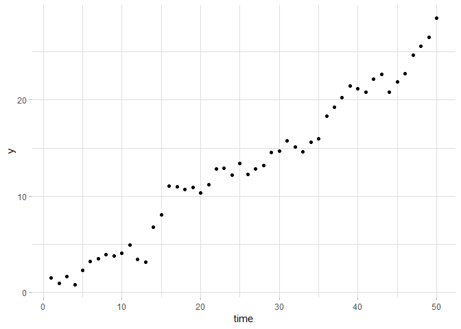
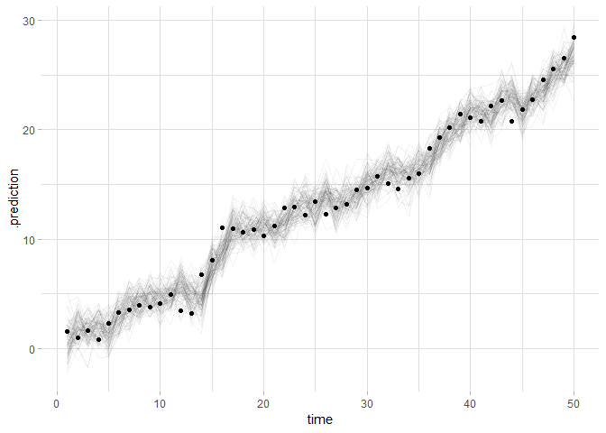
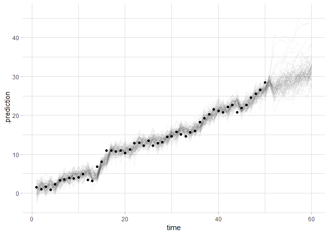
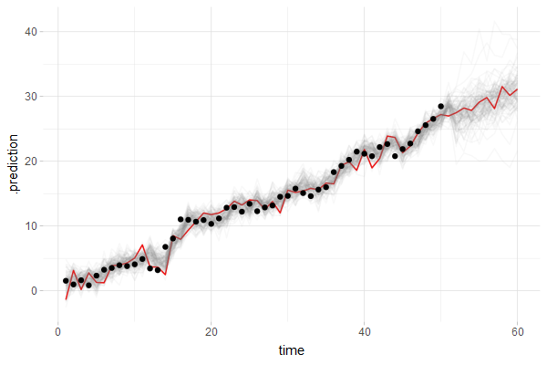
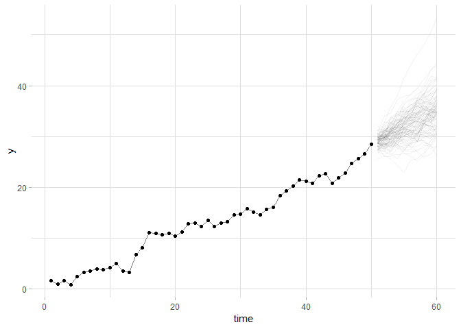
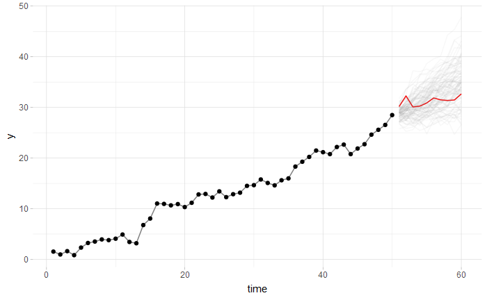

Uncertainty examples with ARIMA in brms and bsts
================

## Introduction

This example shows some spaghetti plots and hypothetical outcome plots
(HOPs) of uncertainty for time series models, first using the `brms`
package then using the `bsts` package.

## Setup

``` r
library(tidyverse)
library(ggplot2)
library(rstan)
library(modelr)
library(tidybayes)
library(brms)
library(bsts)
library(gganimate)

theme_set(theme_light() + theme(
  panel.border = element_blank()
))
rstan_options(auto_write = TRUE)
options(mc.cores = parallel::detectCores())
```

## Data

We’ll use example data based on [this brms
issue](https://github.com/paul-buerkner/brms/issues/398)

``` r
set.seed(250)
t_drift = arima.sim(list(order = c(1,0,0), ar = 0.8), n = 50) + 0.50 * seq(1,50)
t_drift_df = data_frame(
  time = seq_along(t_drift),
  y = as.vector(t_drift)
)
```

Which looks like:

``` r
t_drift_df %>%
  ggplot(aes(x = time, y = y)) +
  geom_point()
```

<!-- -->

## Using `brms`

### Model

A simple autoregressive model in brms:

``` r
m <- brm(y ~ 1 + time, autocor = cor_ar(~ 1, p = 1), data = t_drift_df)
```

    ## Compiling the C++ model

    ## Start sampling

### Spaghetti plot

We’ll start with a spaghetti plot:

``` r
t_drift_df %>%
  add_predicted_draws(m, n = 100) %>%
  ggplot(aes(x = time, y = .prediction)) +
  geom_line(aes(group = .draw), alpha = 1/20) +
  geom_point(aes(y = y), data = t_drift_df)
```

<!-- -->

We can add forecasting:

``` r
t_drift_df %>%
  bind_rows(data_frame(time = max(.$time + 1):max(.$time + 10))) %>%
  add_predicted_draws(m, n = 100) %>%
  ggplot(aes(x = time, y = .prediction)) +
  geom_line(aes(group = .draw), alpha = 1/20) +
  geom_point(aes(y = y), data = t_drift_df)
```

<!-- -->

And finally, animation:

``` r
ndraws = 100

p = t_drift_df %>%
  bind_rows(data_frame(time = max(.$time + 1):max(.$time + 10))) %>%
  add_predicted_draws(m, n = ndraws) %>%
  ggplot(aes(x = time, y = .prediction)) +
  geom_line(aes(group = .draw), color = "red") +
  geom_point(aes(y = y), data = t_drift_df) +
  transition_states(.draw, 1, 3) +
  shadow_mark(future = TRUE, color = "gray50", alpha = 1/20) +
  exit_recolor(color = "gray97") +
  enter_recolor(color = "gray97")

animate(p, nframes = ndraws * 5, fps = 10, width = 700, height = 432, res = 100, type = "cairo")
```

<!-- -->

## Using `bsts`

Now let’s try with the `bsts` (Bayesian structural time series)
package.

### Model

``` r
m2 = with(t_drift_df, bsts(y, state.specification = AddLocalLinearTrend(list(), y), niter = 5000))
```

    ## =-=-=-=-= Iteration 0 Tue Jan 08 00:20:11 2019
    ##  =-=-=-=-=
    ## =-=-=-=-= Iteration 500 Tue Jan 08 00:20:11 2019
    ##  =-=-=-=-=
    ## =-=-=-=-= Iteration 1000 Tue Jan 08 00:20:11 2019
    ##  =-=-=-=-=
    ## =-=-=-=-= Iteration 1500 Tue Jan 08 00:20:11 2019
    ##  =-=-=-=-=
    ## =-=-=-=-= Iteration 2000 Tue Jan 08 00:20:12 2019
    ##  =-=-=-=-=
    ## =-=-=-=-= Iteration 2500 Tue Jan 08 00:20:12 2019
    ##  =-=-=-=-=
    ## =-=-=-=-= Iteration 3000 Tue Jan 08 00:20:12 2019
    ##  =-=-=-=-=
    ## =-=-=-=-= Iteration 3500 Tue Jan 08 00:20:12 2019
    ##  =-=-=-=-=
    ## =-=-=-=-= Iteration 4000 Tue Jan 08 00:20:12 2019
    ##  =-=-=-=-=
    ## =-=-=-=-= Iteration 4500 Tue Jan 08 00:20:12 2019
    ##  =-=-=-=-=

### Spaghetti plot

And the plot as before. This time we just show the forecast, as that is
easier. This also shows how to use `add_draws` and `sample_draws` to
replace the functionality of `add_predicted_draws` when you are working
with a package that `tidybayes` has not yet implemented support for
`add_predicted_draws` (these are in the dev version of `tidybayes` only
as of this writing).

``` r
horizon = 10

data_frame(time = max(t_drift_df$time) + 1:horizon) %>%
  add_draws(predict(m2, horizon = horizon)$distribution) %>%
  sample_draws(100) %>%
  ggplot(aes(x = time, y = y)) +
  geom_line(aes(y = .value, group = .draw), alpha = 1/20) +
  geom_line(data = t_drift_df, color = "gray50") +
  geom_point(data = t_drift_df)
```

<!-- -->

``` r
horizon = 10
ndraws = 100

p = data_frame(time = max(t_drift_df$time) + 1:horizon) %>%
  add_draws(predict(m2, horizon = horizon)$distribution) %>%
  sample_draws(ndraws) %>%
  ggplot(aes(x = time, y = y)) +
  geom_line(aes(y = .value, group = .draw), color = "red") +
  geom_line(data = t_drift_df, color = "gray50") +
  geom_point(data = t_drift_df) +
  transition_states(.draw, 1, 3) +
  shadow_mark(future = TRUE, color = "gray50", alpha = 1/20) +
  exit_recolor(color = "gray97") +
  enter_recolor(color = "gray97")

animate(p, nframes = ndraws * 5, fps = 10, width = 700, height = 432, res = 100, type = "cairo")
```

<!-- -->
