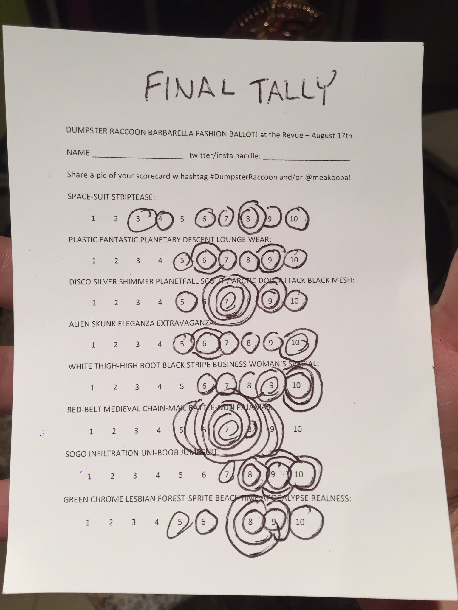
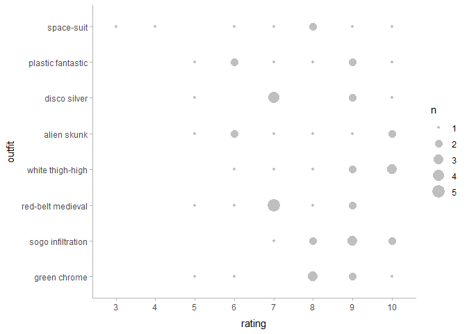
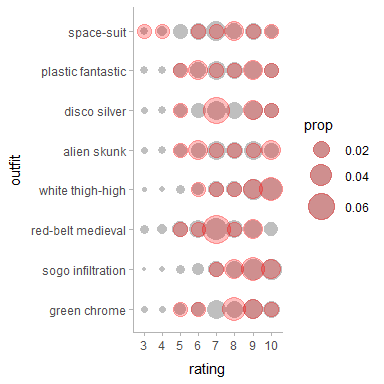
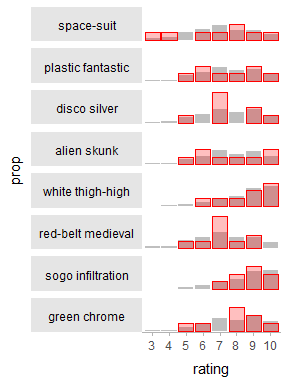
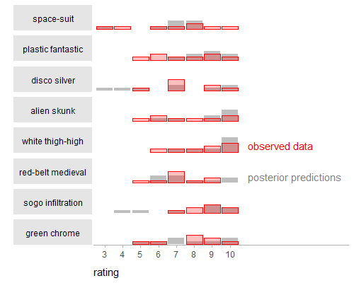
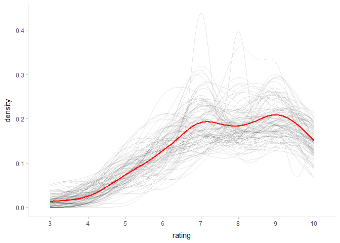
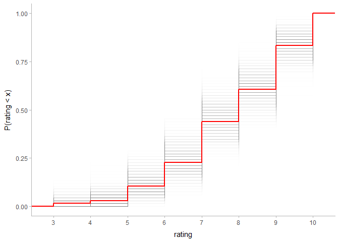
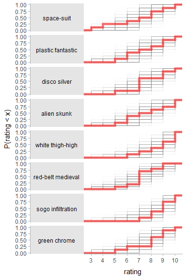
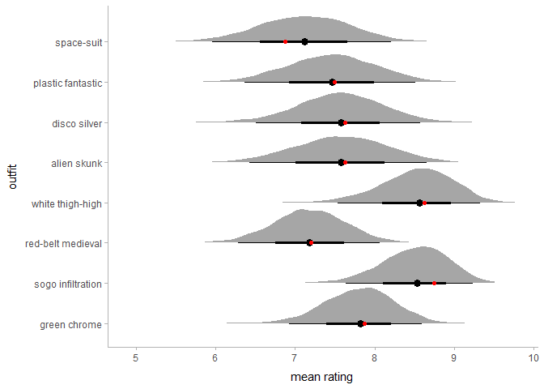
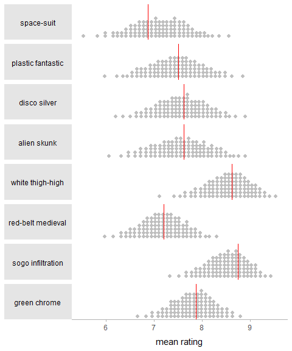

Racoon plots (and other ordinal examples) for Barbarella outfit data
================

## Setup

The following libraries are needed:

``` r
library(tidyverse)
library(modelr)
library(rstan)
library(brms)
library(tidybayes)
library(ggstance)
library(gganimate)      # devtools::install_github("/thomasp85/gganimate")
library(forcats)

theme_set(theme_tidybayes())

rstan_options(auto_write = TRUE)
options(mc.cores = parallel::detectCores())
```

## Data

We’re going to use [this
data](https://twitter.com/meakoopa/status/1031007386725703680):



Which is (approximately) this:

``` r
barb = rbind(
  data.frame(
    outfit = "space-suit",
    rating = c(3,4,6,7,8,8,9,10)
  ),
  data.frame(
    outfit = "plastic fantastic",
    rating = c(5,6,6,7,8,9,9,10)
  ),
  data.frame(
    outfit = "disco silver",
    rating = c(5,7,7,7,7,9,9,10)
  ),
  data.frame(
    outfit = "alien skunk",
    rating = c(5,6,6,7,8,9,10,10)
  ),
  data.frame(
    outfit = "white thigh-high",
    rating = c(6,7,8,9,9,10,10,10)
  ),
  data.frame(
    # I'm pretty sure I transcribed this one incorrectly...
    outfit = "red-belt medieval",
    rating = c(5,6,7,7,7,7,7,8,9,9)
  ),
  data.frame(
    outfit = "sogo infiltration",
    rating = c(7,8,8,9,9,9,10,10)
  ),
  data.frame(
    outfit = "green chrome",
    rating = c(5,6,8,8,8,9,9,10)
  )
) %>%
  mutate(
    # reversing order here makes the display order correct
    outfit = fct_rev(outfit),
    rating = ordered(rating)
  )
```

Which looks like this:

``` r
barb %>%
  ggplot(aes(x = rating, y = outfit)) +
  geom_count(color = "gray75")
```

<!-- -->

## Model

We’ll fit a simple ordinal regression.

**N.B.**: Do not use these results for important Barbarella-related
decision-making\! At the very least, there were presumably repeat raters
in this data which we would probably want to incorporate into the model,
not to mention coming up with reasonably Barbarella-informed priors in
order to make the best Barbarella-related decisions we could.

``` r
m = brm(rating ~ outfit, data = barb, family = cumulative, 
  prior = c(
    prior(normal(0, 2), class = b),
    prior(normal(0, 4), class = Intercept)
  ),
  control = list(adapt_delta = .99), seed = 12345,
  file = "barbarella"
)
```

## Posterior predictive check

Here’s a sort of racoon plot:

``` r
barb %>%
  select(outfit) %>%
  add_predicted_draws(m, prediction = "rating", seed = 494930) %>%
  ggplot(aes(x = rating, y = outfit, group = NA)) +
  geom_count(aes(size = stat(prop)), color = "gray75") +
  geom_count(aes(size = stat(prop)), data = barb, color = "red", alpha = 0.25) +
  scale_size_continuous(range = c(1,10))
```

<!-- -->

I’m not sure how well this plot works in this case. It takes a bit more
work to investigate each row.

Perhaps this plot is more applicable when the predictor is continuous
(as in the case of mpg/cyl in the `mtcars` dataset) than here, where the
predictor is categorical (`outfit`). The plot is complicated here
because the observed data *and* the posterior prediction are encoding
information in the size of their respective dots, which was not the case
for the `mtcars` example in the `tidybayes` docs, which I think made it
much easier to read.

One alternative might be bars:

``` r
barb %>%
  select(outfit) %>%
  add_predicted_draws(m, prediction = "rating", seed = 494930) %>%
  ggplot(aes(x = rating, group = NA)) +
  geom_bar(aes(y = stat(prop)), fill = "gray75") +
  geom_bar(aes(y = stat(prop)), data = barb, color = "red", fill = "red", alpha = 0.25) +
  facet_grid(rows = vars(fct_rev(outfit)), switch = "y") +
  facet_title_left_horizontal() +
  scale_y_continuous(breaks = NULL)
```

<!-- -->

Although perhaps using hypothetical outcome plots (HOPs) (Hullman,
Resnick, and Adar [2015](#ref-Hullman2015); Kale et al.
[2019](#ref-Kale2018)) makes more sense here:

``` r
n_hops =  100

p = barb %>%
  select(outfit) %>%
  add_predicted_draws(m, prediction = "rating", n = n_hops, seed = 494930) %>%
  ggplot(aes(x = rating, group = NA)) +
  geom_bar(aes(y = stat(prop)), fill = "gray75") +
  geom_bar(aes(y = stat(prop)), data = barb, color = "red", fill = "red", alpha = 0.25) +
  facet_grid(rows = vars(fct_rev(outfit)), switch = "y") +
  facet_title_left_horizontal() +
  scale_y_continuous(breaks = NULL) +
  transition_states(.draw, transition_length = 1, state_length = 1)

animate(p, nframes = n_hops * 2, width = 250, height = 400)
```

<!-- -->

This is overwhelming at first, but if you focus on particular regions it
can be legible.

Or here’s a more traditional posterior predictive check plot:

``` r
barb %>%
  select(outfit) %>%
  add_predicted_draws(m, prediction = "rating", n = 100, seed = 494930) %>%
  ggplot(aes(x = rating)) +
  stat_density(aes(group = .draw), geom = "line", position = "identity", alpha = .1) +
  stat_density(aes(group = NA), geom = "line", data = barb, color = "red", size = 1) 
```

<!-- -->

Although using density here does not make much sense since `rating` is
discrete, so how about this:

``` r
barb %>%
  select(outfit) %>%
  add_predicted_draws(m, prediction = "rating", n = 100, seed = 494930) %>%
  ggplot(aes(x = rating)) +
  stat_count(aes(group = .draw, y = stat(prop)), geom = "line", position = "identity", alpha = .1) +
  stat_count(aes(group = NA, y = stat(prop)), geom = "line", data = barb, color = "red", size = 1) 
```

<!-- -->

Although then it probably makes sense to look at the CDF:

``` r
barb %>%
  select(outfit) %>%
  add_predicted_draws(m, prediction = "rating", n = 1000, seed = 494930) %>%
  ggplot(aes(x = rating)) +
  stat_ecdf(aes(group = .draw), alpha = 1/200) +
  stat_ecdf(aes(group = NA), data = barb, color = "red", size = 1) +
  ylab("P(rating < x)")
```

<!-- -->

Or even CDF within `outfit`:

``` r
barb %>%
  select(outfit) %>%
  add_predicted_draws(m, prediction = "rating", n = 1000, seed = 494930) %>%
  ggplot(aes(x = rating)) +
  stat_ecdf(aes(group = .draw), alpha = 1/200) +
  stat_ecdf(aes(group = NA), data = barb, color = "red", size = 2, alpha = .5) +
  facet_grid(rows = vars(fct_rev(outfit)), switch = "y") +
  facet_title_left_horizontal() +
  ylab("P(rating < x)")
```

<!-- -->

## Mean ratings

Finally, posterior distribution for the mean rating by outfit (along
with the sample mean in red):

``` r
barb %>%
  data_grid(outfit) %>%
  add_fitted_draws(m, value = "P(rating | outfit)") %>%
  mutate(rating = as.numeric(as.character(.category))) %>%
  group_by(outfit, .draw) %>%
  summarise(`mean rating` = sum(rating * `P(rating | outfit)`)) %>%
  ggplot(aes(x = `mean rating`, y = outfit)) +
  geom_halfeyeh() +
  stat_summaryh(aes(x = as.numeric(as.character(rating))), geom = "point", fun.x = mean, data = barb, color = "red")
```

<!-- -->

Or as quantile dotplots (Kay et al. [2016](#ref-Kay2016); Fernandes et
al. [2018](#ref-Fernandes2018)):

``` r
barb %>%
  data_grid(outfit) %>%
  add_fitted_draws(m, value = "P(rating | outfit)") %>%
  mutate(rating = as.numeric(as.character(.category))) %>%
  group_by(outfit, .draw) %>%
  summarise(`mean rating` = sum(rating * `P(rating | outfit)`)) %>%
  do(data_frame(`mean rating` = quantile(.$`mean rating`, ppoints(100)))) %>%
  ggplot(aes(x = `mean rating`)) +
  geom_dotplot(binwidth = .075, color = NA, fill = "gray75") +
  geom_vline(aes(xintercept = `mean rating`), color = "red",
    data = barb %>% group_by(outfit) %>% summarise(`mean rating` = mean(as.numeric(as.character(rating))))) +
  facet_grid(rows = vars(fct_rev(outfit)), switch = "y") +
  facet_title_left_horizontal() +
  ylab(NULL) +
  scale_y_continuous(breaks = NULL)
```

<!-- -->

## References

<div id="refs" class="references">

<div id="ref-Fernandes2018">

Fernandes, Michael, Logan Walls, Sean Munson, Jessica Hullman, and
Matthew Kay. 2018. “Uncertainty Displays Using Quantile Dotplots or CDFs
Improve Transit Decision-Making.” *Conference on Human Factors in
Computing Systems - CHI ’18*. <https://doi.org/10.1145/3173574.3173718>.

</div>

<div id="ref-Hullman2015">

Hullman, Jessica, Paul Resnick, and Eytan Adar. 2015. “Hypothetical
Outcome Plots Outperform Error Bars and Violin Plots for Inferences
about Reliability of Variable Ordering.” *PloS One* 10 (11). Public
Library of Science. <https://doi.org/10.1371/journal.pone.0142444>.

</div>

<div id="ref-Kale2018">

Kale, Alex, Francis Nguyen, Matthew Kay, and Jessica Hullman. 2019.
“Hypothetical Outcome Plots Help Untrained Observers Judge Trends in
Ambiguous Data.” *Transactions on Visualization and Computer Graphics*.

</div>

<div id="ref-Kay2016">

Kay, Matthew, Tara Kola, Jessica R Hullman, and Sean A Munson. 2016.
“When (ish) is My Bus? User-centered Visualizations of Uncertainty in
Everyday, Mobile Predictive Systems.” *Proceedings of the 2016 CHI
Conference on Human Factors in Computing Systems - CHI ’16*, 5092–5103.
<https://doi.org/10.1145/2858036.2858558>.

</div>

</div>
