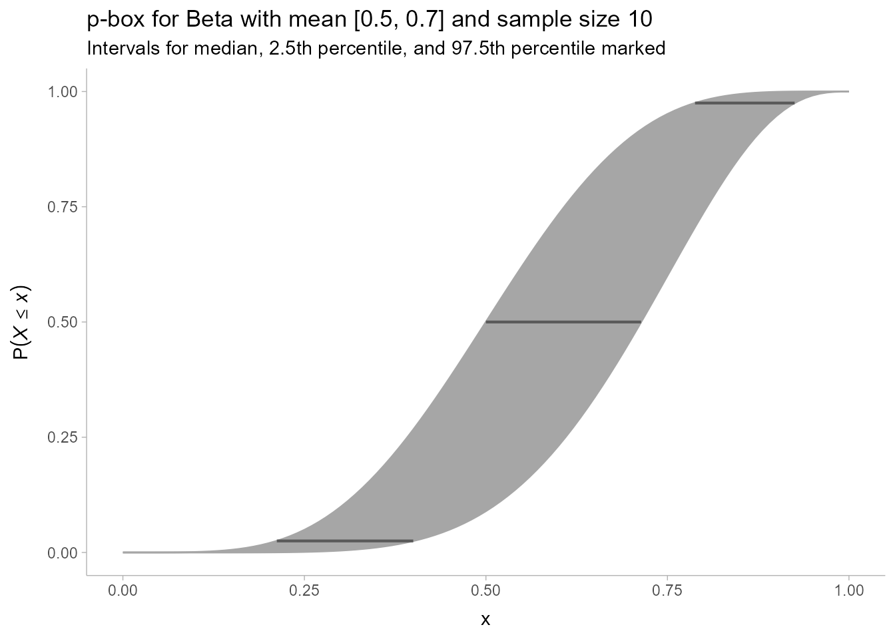

Probability box of a Beta distribution
================
Matthew Kay
2023-03-01

``` r
library(ggplot2)
library(tibble)

theme_set(ggdist::theme_ggdist())
knitr::opts_chunk$set(dev = "ragg_png", fig.retina = 2)
```

A simple probability box (see [Ferson and Siegrist, Verified Computation
with Probabilities](https://inria.hal.science/hal-01518666/document)) of
a Beta distribution with an interval mean (inspired by [Kerwin and
Pandey, Navigating
Ambiguity](https://jasonkerwin.com/Papers/NavigatingAmbiguity/Kerwin_and_Pandey_NavigatingAmbiguity_latest.pdf))

``` r
pbeta_mu = \(x, mu, nu) pbeta(x, mu * nu, (1 - mu) * nu)
qbeta_mu = \(p, mu, nu) qbeta(p, mu * nu, (1 - mu) * nu)
mu_upper = 0.5
mu_lower = 0.7
nu = 10

annotate_probability = \(p) annotate("segment", 
  x = qbeta_mu(p, mu_lower, nu), xend = qbeta_mu(p, mu_upper, nu), 
  y = p, yend = p, 
  color = "gray35", linewidth = 0.75
)

tibble(
  x = seq(0, 1, length.out = 101),
  lower = pbeta_mu(x, mu_lower, nu),
  upper = pbeta_mu(x, mu_upper, nu)
) |> 
  ggplot(aes(x = x, ymin = lower, ymax = upper)) + 
  geom_ribbon(fill = "gray65", color = "gray65") + 
  annotate_probability(0.025) +
  annotate_probability(0.5) +
  annotate_probability(0.975) +
  labs(
    title = "p-box for Beta with mean [0.5, 0.7] and sample size 10",
    subtitle = "Intervals for median, 2.5th percentile, and 97.5th percentile marked",
    y = quote(P(italic(X) <= italic(x)))
  )
```


