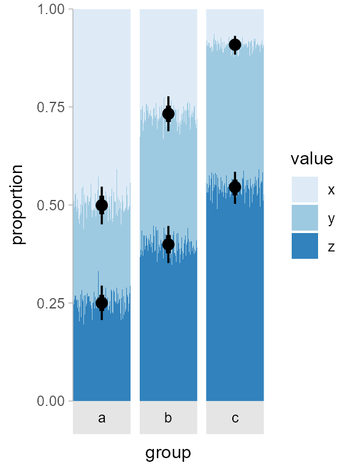

Uncertainty in cumulative proportions
================
Matthew Kay
2024-09-07

## Setup

``` r
library(dplyr)
library(tidyr)
library(ggplot2)
library(ggdist)
theme_set(theme_ggdist())

set.seed(1234)
```

## Data

Create a data frame of:

- `.draw`: index of draw from the distribution in \[1, 1000\]
- `group`: a group in {a, b, c}
- `value`: value of the variable in {x, y, z}
- `proportion`: proportion in (0, 1) that sums to 1 within each `.draw`
  x `group`.

``` r
df = brms::rdirichlet(3000, matrix(c(200, 100, 100, 100, 125, 150, 50, 200, 300), nrow = 3)) |>
  as.data.frame() |>
  setNames(c("x", "y", "z")) |>
  mutate(.draw = rep(1:1000, each = 3), group = rep(c("a", "b", "c"), 1000))  |>
  pivot_longer(c(x, y, z), names_to = "value", values_to = "proportion")

head(df, n = 12)
```

    ## # A tibble: 12 × 4
    ##    .draw group value proportion
    ##    <int> <chr> <chr>      <dbl>
    ##  1     1 a     x         0.478 
    ##  2     1 a     y         0.269 
    ##  3     1 a     z         0.253 
    ##  4     1 b     x         0.265 
    ##  5     1 b     y         0.344 
    ##  6     1 b     z         0.392 
    ##  7     1 c     x         0.0959
    ##  8     1 c     y         0.348 
    ##  9     1 c     z         0.556 
    ## 10     2 a     x         0.501 
    ## 11     2 a     y         0.249 
    ## 12     2 a     z         0.250

## Fuzzy bars

Fuzzy barplot (H/T Solomon Kurz for the idea; see
[here](https://twitter.com/SolomonKurz/status/1372632774285348864?s=20)
and [here](https://github.com/mjskay/ggdist/issues/109)):

``` r
df |>
  ggplot(aes(y = proportion)) +
  geom_col(aes(x = .draw, fill = value), position = "stack", width = 1) +
  stat_pointinterval(
    aes(x = mean(.draw), group = value), 
    data = \(d) d |> 
      # need 1 - p because position_stack goes top to bottom
      # (or use position_stack(reverse = TRUE) above)
      mutate(proportion = 1 - cumsum(proportion), .by = c(.draw, group)) |> 
      # last proportion is pointless to plot because it is 0 with no uncertainty
      filter(value != "z")
  ) +
  scale_fill_brewer() +
  facet_grid(. ~ group, switch = "x") +
  coord_cartesian(expand = FALSE) +
  scale_x_continuous(breaks = NULL) +
  xlab("group")
```


