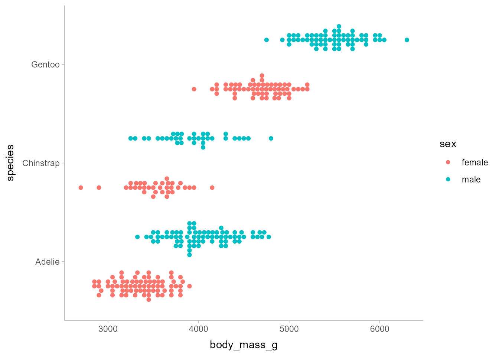
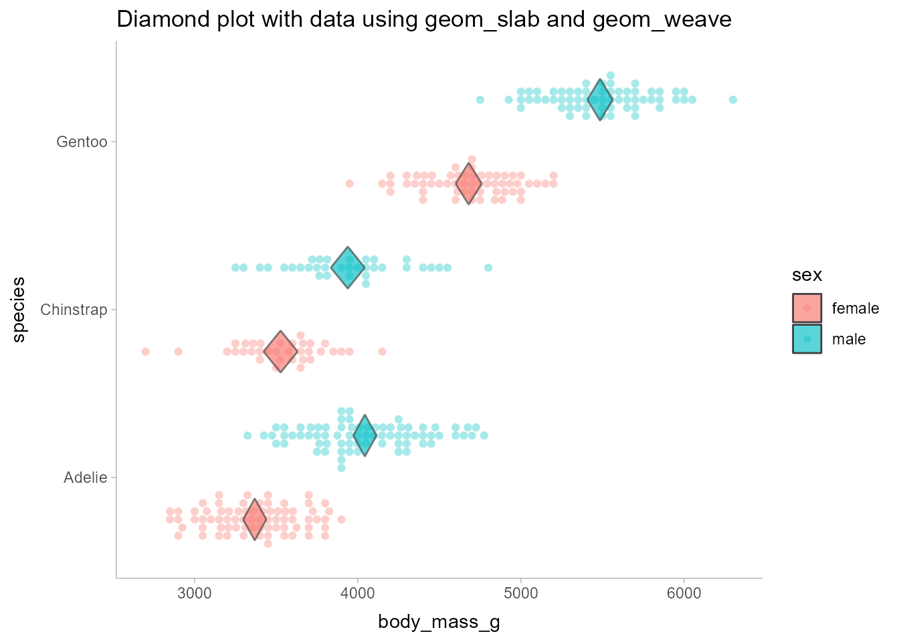

Diamond plot with data using geom_slab and geom_weave
================
Matthew Kay
2023-09-26

``` r
library(palmerpenguins)
library(ggplot2)
library(ggdist)
library(dplyr)
library(tidyr)

theme_set(theme_ggdist())
knitr::opts_chunk$set(dev = "ragg_png", fig.retina = 2)
```

Let’s fit a simple model for mean body mass of penguins based on this
data:

``` r
penguins_clean = filter(penguins, !is.na(sex))

penguins_clean |>
  ggplot(aes(x = body_mass_g, y = species, fill = sex)) +
  geom_weave(position = "dodge", linewidth = NA)
```



Here’s a model for average body mass conditional on sex and species:

``` r
m = lm(body_mass_g ~ species * sex, data = penguins_clean)
m
```

    ## 
    ## Call:
    ## lm(formula = body_mass_g ~ species * sex, data = penguins_clean)
    ## 
    ## Coefficients:
    ##              (Intercept)          speciesChinstrap             speciesGentoo  
    ##                   3368.8                     158.4                    1310.9  
    ##                  sexmale  speciesChinstrap:sexmale     speciesGentoo:sexmale  
    ##                    674.7                    -262.9                     130.4

We can get conditional means and confidence intervals from the model:

``` r
grid = penguins_clean |>
  modelr::data_grid(sex, species)

preds = cbind(grid, predict(m, newdata = grid, interval = "confidence"))
preds
```

    ##      sex   species      fit      lwr      upr
    ## 1 female    Adelie 3368.836 3297.597 3440.074
    ## 2 female Chinstrap 3527.206 3422.821 3631.590
    ## 3 female    Gentoo 4679.741 4599.820 4759.662
    ## 4   male    Adelie 4043.493 3972.255 4114.731
    ## 5   male Chinstrap 3938.971 3834.586 4043.355
    ## 6   male    Gentoo 5484.836 5406.905 5562.767

To create the diamonds, we will reshape this data into a data frame with
three rows per `sex*species` combination, one for the point estimate,
and one for each end of the interval. We’ll also add an `is_point`
column that is `1` for the point estimate and `0` for the interval
endpoints.

``` r
preds_long = preds |>
  pivot_longer(c(fit, lwr, upr)) |>
  mutate(is_point = as.integer(name == "fit"))

preds_long
```

    ## # A tibble: 18 × 5
    ##    sex    species   name  value is_point
    ##    <fct>  <fct>     <chr> <dbl>    <int>
    ##  1 female Adelie    fit   3369.        1
    ##  2 female Adelie    lwr   3298.        0
    ##  3 female Adelie    upr   3440.        0
    ##  4 female Chinstrap fit   3527.        1
    ##  5 female Chinstrap lwr   3423.        0
    ##  6 female Chinstrap upr   3632.        0
    ##  7 female Gentoo    fit   4680.        1
    ##  8 female Gentoo    lwr   4600.        0
    ##  9 female Gentoo    upr   4760.        0
    ## 10 male   Adelie    fit   4043.        1
    ## 11 male   Adelie    lwr   3972.        0
    ## 12 male   Adelie    upr   4115.        0
    ## 13 male   Chinstrap fit   3939.        1
    ## 14 male   Chinstrap lwr   3835.        0
    ## 15 male   Chinstrap upr   4043.        0
    ## 16 male   Gentoo    fit   5485.        1
    ## 17 male   Gentoo    lwr   5407.        0
    ## 18 male   Gentoo    upr   5563.        0

We can use the `is_point` column to set the thickness of a slab
geometry, so that it has maximum thickness at the point estimate and
zero thickness at the interval endpoints. We also set `scale = 0.5` for
`geom_slab()` so that the diamonds are not too tall:

``` r
penguins_clean |>
  ggplot(aes(x = body_mass_g, y = species, fill = sex)) +
  geom_weave(position = "dodge", linewidth = NA, alpha = 0.35) +
  geom_slab(
    aes(x = value, y = species, thickness = is_point), 
    position = "dodge", 
    data = preds_long, 
    side = "both", 
    scale = 0.5, 
    alpha = 0.65, 
    color = "gray25", 
    linewidth = 0.5
  ) +
  labs(
    title = "Diamond plot with data using geom_slab and geom_weave"
  )
```


