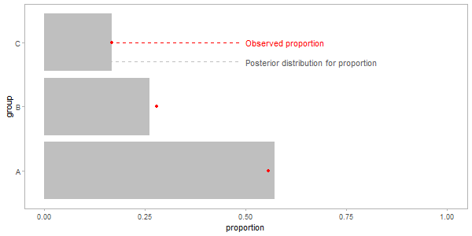
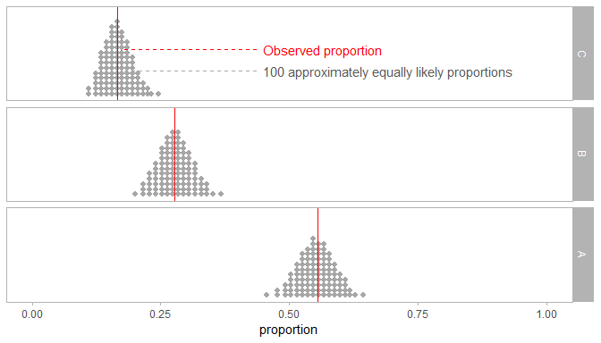

Hypothetical Outcome Plots (HOPs) for proportions
================

Here is a quick example of hypothetical outcome plots (HOPs) for
proportions

## Setup

The following libraries are needed:

``` r
library(tidyverse)
library(modelr)
library(rstanarm)
library(tidybayes)
library(gganimate)     # devtools::install_github("thomasp85/gganimate")
library(ggstance)
library(forcats)

theme_set(
  theme_light() +
  theme(panel.grid = element_blank())
)
```

## Data

We’ll use some count data to illustrate:

``` r
df = data_frame(
  group = c("A","B","C"),
  count = c(100, 50, 30),
  proportion = count / sum(count)
)
df
```

    ## # A tibble: 3 x 3
    ##   group count proportion
    ##   <chr> <dbl>      <dbl>
    ## 1 A       100      0.556
    ## 2 B        50      0.278
    ## 3 C        30      0.167

## Model

One *possible* model for this data is as follows (N.B. this makes some
strong assumptions about how the data were generated for the purposes of
an example, your mileage may vary\!):

``` r
m = stan_glm(count ~ group, family = poisson, data = df)
```

## HOPs

Given that model, we could construct a HOPs (Hullman, Resnick, and Adar
[2015](#ref-Hullman2015); Kale et al. [2019](#ref-Kale2018)) bar chart
illustrating the posterior distribution for the proportion in each
group:

``` r
n_hops = 100

p = df %>%
  data_grid(group) %>%
  add_fitted_draws(m, n = n_hops) %>%
  group_by(.draw) %>%
  mutate(proportion = .value / sum(.value)) %>%
  ggplot(aes(y = group, x = proportion)) +
  geom_colh(fill = "gray75") +
  geom_point(data = df, color = "red") +
  annotate("text", y = "C", x = .5, label = "Observed proportion", hjust = 0, color = "red") +
  annotate("segment", y = "C", yend = "C", x = .18, xend = .49, linetype = "dashed", color = "red") +
  annotate("text", y = 2.7, x = .5, label = "Posterior distribution for proportion", hjust = 0,
    color = "gray35") +
  annotate("segment", y = 2.7, yend = 2.7, x = .1, xend = .49, linetype = "dashed", color = "gray75") +
  xlim(0,1) +
  transition_states(.draw, transition_length = 1, state_length = 1)

animate(p, nframes = n_hops * 2, width = 600, height = 300)
```

<!-- -->

## Quantile dotplots (static alternative)

If animation were not available (e.g. in a print medium), an alternative
might be a quantile dotplot (Kay et al. [2016](#ref-Kay2016); Fernandes
et al. [2018](#ref-Fernandes2018)):

``` r
observed_label_data = data_frame(
  group = "C",
  label = "Observed proportion",
  x = .18, xend = .44, y = .55
)
dotplot_label_data = data_frame(
  group = "C",
  label = "100 approximately equally likely proportions",
  x = .18, xend = .44, y = .3
)


df %>%
  data_grid(group) %>%
  add_fitted_draws(m) %>%
  group_by(.draw) %>%
  mutate(proportion = .value / sum(.value)) %>%
  group_by(group) %>%
  do(data_frame(proportion = quantile(.$proportion, ppoints(100)))) %>%
  ggplot(aes(x = proportion)) +
  geom_dotplot(binwidth = .01, fill = "gray65", color = NA) +
  facet_grid(fct_rev(group) ~ .) +
  geom_text(aes(xend + .01, y, label = label), data = observed_label_data, hjust = 0, color = "red") +
  geom_segment(aes(x, y, xend = xend, yend = y), data = observed_label_data,
    linetype = "dashed", color = "red") +
  geom_vline(aes(xintercept = proportion), data = df, color = "red") +
  geom_text(aes(xend + .01, y, label = label), data = dotplot_label_data, hjust = 0, color = "gray35") +
  geom_segment(aes(x, y, xend = xend, yend = y), data = dotplot_label_data,
    linetype = "dashed", color = "gray65") +
  xlim(0,1) +
  ylab(NULL) +
  scale_y_continuous(breaks = NULL)
```

<!-- -->

## References

<div id="refs" class="references">

<div id="ref-Fernandes2018">

Fernandes, Michael, Logan Walls, Sean Munson, Jessica Hullman, and
Matthew Kay. 2018. “Uncertainty Displays Using Quantile Dotplots or CDFs
Improve Transit Decision-Making.” *Conference on Human Factors in
Computing Systems - CHI ’18*. <https://doi.org/10.1145/3173574.3173718>.

</div>

<div id="ref-Hullman2015">

Hullman, Jessica, Paul Resnick, and Eytan Adar. 2015. “Hypothetical
Outcome Plots Outperform Error Bars and Violin Plots for Inferences
about Reliability of Variable Ordering.” *PloS One* 10 (11). Public
Library of Science. <https://doi.org/10.1371/journal.pone.0142444>.

</div>

<div id="ref-Kale2018">

Kale, Alex, Francis Nguyen, Matthew Kay, and Jessica Hullman. 2019.
“Hypothetical Outcome Plots Help Untrained Observers Judge Trends in
Ambiguous Data.” *Transactions on Visualization and Computer Graphics*.

</div>

<div id="ref-Kay2016">

Kay, Matthew, Tara Kola, Jessica R Hullman, and Sean A Munson. 2016.
“When (ish) is My Bus? User-centered Visualizations of Uncertainty in
Everyday, Mobile Predictive Systems.” *Proceedings of the 2016 CHI
Conference on Human Factors in Computing Systems - CHI ’16*, 5092–5103.
<https://doi.org/10.1145/2858036.2858558>.

</div>

</div>
