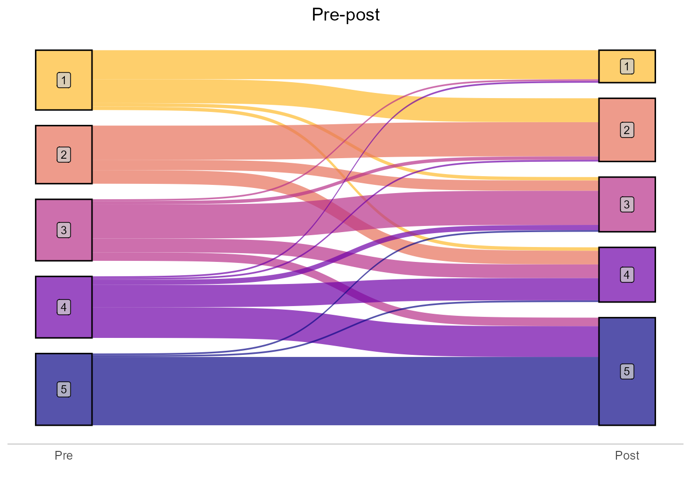
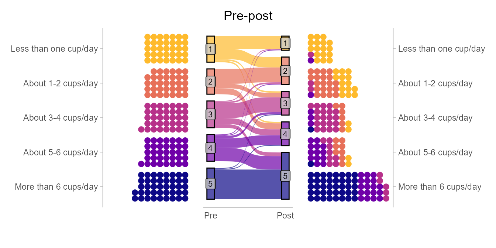

Likert Sankey Dotplot
================
Matthew Kay
2024-10-14

A quick riff on Matt Cooper and Zac Dempsey’s [post on using Sankey
diagrams to display Likert
data](https://the-kids-biostats.github.io/posts/2024-10-14_likert_visualisation/likert_visualisations.html).

## Setup

## Data

Data from the original post:

``` r
# dat_i is the intervention group
n <- 183 # Set the number of individuals
def <- defData(varname = "pre", formula = "1;5", dist = "uniformInt") # Pre values: uniformly distributed between 1 and 5
dat_i <- genData(n, def)
group_probs <- c(0.45, 0.45, 0.10)
set.seed(123) # For reproducibility
dat_i$grp <- sample(1:3, n, replace = TRUE, prob = group_probs)
dat_i$post <- dat_i$pre

dat_i$post[dat_i$grp == 2] <- pmin(dat_i$pre[dat_i$grp == 2] + (rbinom(sum(dat_i$grp == 2), 2, 0.2) + 1), 5) # Increase by 1, max 5
dat_i$post[dat_i$grp == 3] <- pmax(dat_i$pre[dat_i$grp == 3] - (rbinom(sum(dat_i$grp == 3), 2, 0.2) + 1), 1) # Decrease by 1, min 1
# dat_c is the control group
n <- 154 # Set the number of individuals
def <- defData(varname = "pre", formula = "1;5", dist = "uniformInt") # Pre values: uniformly distributed between 1 and 5
dat_c <- genData(n, def)
group_probs <- c(0.55, 0.25, 0.20)
set.seed(123) # For reproducibility
dat_c$grp <- sample(1:3, n, replace = TRUE, prob = group_probs)
dat_c$post <- dat_c$pre

dat_c$post[dat_c$grp == 2] <- pmin(dat_c$pre[dat_c$grp == 2] + (rbinom(sum(dat_c$grp == 2), 2, 0.2) + 1), 5) # Increase by 1, max 5
dat_c$post[dat_c$grp == 3] <- pmax(dat_c$pre[dat_c$grp == 3] - (rbinom(sum(dat_c$grp == 3), 2, 0.2) + 1), 1) # Decrease by 1, min 1

dat <- rbind(cbind(dat_i, group = "Intervention"), 
             cbind(dat_c, group = "Control")) %>% 
  mutate(post = as.integer(post)) %>% 
  select(-grp)

response_levels = c("Less than one cup/day", "About 1-2 cups/day", "About 3-4 cups/day", "About 5-6 cups/day","More than 6 cups/day")
dat <- dat %>% 
  mutate(
    pre_l = factor(pre, 1:5, labels = response_levels),
    post_l = factor(post, 1:5, labels = response_levels)
  )

head(dat, n = 8)
```

    ##       id   pre  post        group                 pre_l               post_l
    ##    <int> <int> <int>       <char>                <fctr>               <fctr>
    ## 1:     1     3     4 Intervention    About 3-4 cups/day   About 5-6 cups/day
    ## 2:     2     4     4 Intervention    About 5-6 cups/day   About 5-6 cups/day
    ## 3:     3     5     5 Intervention  More than 6 cups/day More than 6 cups/day
    ## 4:     4     2     2 Intervention    About 1-2 cups/day   About 1-2 cups/day
    ## 5:     5     4     3 Intervention    About 5-6 cups/day   About 3-4 cups/day
    ## 6:     6     1     2 Intervention Less than one cup/day   About 1-2 cups/day
    ## 7:     7     2     2 Intervention    About 1-2 cups/day   About 1-2 cups/day
    ## 8:     8     5     5 Intervention  More than 6 cups/day More than 6 cups/day

``` r
# head(dat, 5) %>%
  # thekids_table(colour = "Saffron", padding = 3)
```

Sankey plot from the original post:

``` r
max_prop <- dat %>%
  select(id, group, pre, post) %>% 
  pivot_longer(cols = c(pre, post)) %>% 
  group_by(group, name) %>%
  count(value) %>%
  mutate(freq = n / sum(n)) %>% 
  .$freq %>%
  max

max_prop <- plyr::round_any(max_prop, 0.05, f = ceiling)

p_sankey <- dat %>% 
  filter(group == "Intervention") %>% 
  rename(Pre = pre,
         Post = post) %>% 
  make_long(Pre, Post) %>% 
  mutate(node = factor(node, levels = c(7,6,5,4,3,2,1)),
         next_node = factor(next_node, levels = c(7,6,5,4,3,2,1))) %>% 
  ggplot(aes(x = x, 
             next_x = next_x, 
             node = node, 
             next_node = next_node,
             fill = factor(node))) +
  geom_sankey(alpha = 0.7,
              node.color = 'black') +
  geom_sankey_label(aes(label = node), alpha = 0.75,
                    size = 3, color = "black", fill = "gray80") +
  scale_fill_viridis_d(option = "plasma", end = 0.85, guide = "none") +
  scale_x_discrete(expand = c(0.05,0.05)) +
  scale_y_continuous(breaks = NULL) +
  theme(panel.grid.major = element_blank(),
        panel.grid.minor = element_blank(),
        axis.title.y=element_blank(),
        axis.text.y=element_blank(),
        axis.ticks=element_blank(),
        legend.position = "bottom",
        plot.title = element_text(hjust = 0.5)) +
  labs(title = "Pre-post",
       fill = "Pre",
       x = "")

p_sankey
```



## Dotplots + Sankey

Two thoughts occured to me when looking at the original post:

1.  Because the histograms are displayed side-by-side, having the main
    axis be the x axis makes it hard to compare the pre and post
    distributions. This could be fixed either by stacking the histograms
    vertically or by rotating the histograms. If you do the latter, you
    can also mirror one of them to do a more pyramid-style approach.

2.  Dotplots / waffle plots would allow you to show individual
    datapoints, seeing proportions and raw counts simultaneously, and
    also have a consistent coloring by the pre value.

Something like this:

``` r
p_pre = dat |>
  filter(group == "Intervention") |>
  ggplot() +
  # ordinarily I would not set binwidth manually here (and let geom_dots find the optimal binwidth),
  # but because we have to use geom_dots in two different charts we need to pick a shared binwidth
  # to keep things consistent. Can use geom_dots(verbose = TRUE) without a binwidth to find one.
  geom_dots(aes(group = NA, fill = pre_l, y = forcats::fct_rev(pre_l)), layout = "bar", side = "left", color = NA, binwidth = 0.17) +
  scale_fill_viridis_d(option = "plasma", end = 0.85, direction = -1, guide = "none") +
  scale_x_continuous(breaks = NULL) +
  labs(y = NULL, x = NULL)

p_post = dat |>
  filter(group == "Intervention") |>
  ggplot() +
  geom_dots(aes(group = NA, fill = pre_l, y = forcats::fct_rev(post_l), order = forcats::fct_rev(pre_l)), layout = "bar", side = "right", color = NA, binwidth = 0.17) +
  scale_fill_viridis_d(option = "plasma", end = 0.85, direction = -1, guide = "none") +
  scale_y_discrete(position = "right") +
  scale_x_continuous(breaks = NULL) +
  labs(y = NULL, x = NULL)

p_pre + p_sankey + p_post
```

    ## Warning: The provided binwidth will cause dots to overflow the boundaries of the
    ## geometry.
    ## → Set `binwidth = NA` to automatically determine a binwidth that ensures dots
    ##   fit within the bounds,
    ## → OR set `overflow = "compress"` to automatically reduce the spacing between
    ##   dots to ensure the dots fit within the bounds,
    ## → OR set `overflow = "keep"` to allow dots to overflow the bounds of the
    ##   geometry without producing a warning.
    ## ℹ For more information, see the documentation of the `binwidth` and `overflow`
    ##   arguments of `?ggdist::geom_dots()` or the section on constraining dot sizes
    ##   in vignette("dotsinterval") (`vignette(ggdist::dotsinterval)`).


