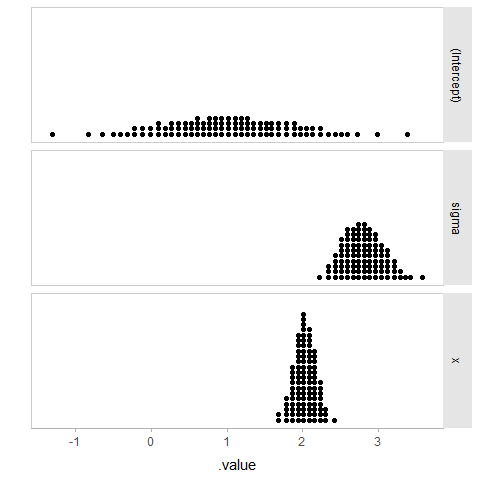
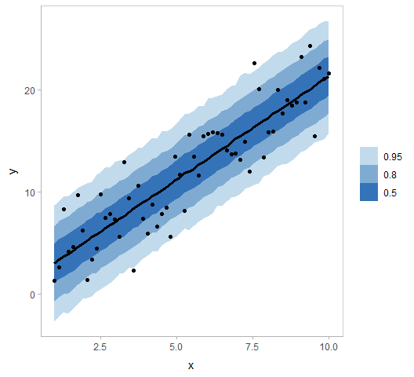

Linear regression
================

## Setup

Libraries that might be of help:

``` r
library(tidyverse)
library(magrittr)
library(ggplot2)
library(rstanarm)
library(modelr)
library(tidybayes)
library(gganimate)
library(colorspace)
library(cowplot)

theme_set(
  theme_tidybayes() +
  panel_border()
)
```

### Data

Let’s generate some vaguely linear data:

``` r
set.seed(123)
sample_size = 60
a = 1
b = 2
sigma = 3


df = data_frame(
  x = seq(1, 10, length.out = sample_size),
  y = rnorm(sample_size, a + b * x, sigma),
  group = rep(c("a", "b"), sample_size/2),
  x_centered = x - mean(x)
) 
```

    ## Warning: `data_frame()` is deprecated, use `tibble()`.
    ## This warning is displayed once per session.

``` r
df
```

    ## # A tibble: 60 x 4
    ##        x     y group x_centered
    ##    <dbl> <dbl> <chr>      <dbl>
    ##  1  1     1.32 a          -4.5 
    ##  2  1.15  2.61 b          -4.35
    ##  3  1.31  8.29 a          -4.19
    ##  4  1.46  4.13 b          -4.04
    ##  5  1.61  4.61 a          -3.89
    ##  6  1.76  9.67 b          -3.74
    ##  7  1.92  6.21 a          -3.58
    ##  8  2.07  1.34 b          -3.43
    ##  9  2.22  3.38 a          -3.28
    ## 10  2.37  4.41 b          -3.13
    ## # ... with 50 more rows

``` r
df %>%
  ggplot(aes(x = x, y = y)) +
  geom_point() 
```

<!-- -->

``` r
m = stan_glm(y ~ x, data = df)
```

``` r
df %>%
  data_grid(x = seq_range(x, n = 100)) %>%
  add_fitted_draws(m) %>%
  median_qi()
```

    ## # A tibble: 100 x 8
    ## # Groups:   x [100]
    ##        x  .row .value .lower .upper .width .point .interval
    ##    <dbl> <int>  <dbl>  <dbl>  <dbl>  <dbl> <chr>  <chr>    
    ##  1  1        1   3.05   1.63   4.51   0.95 median qi       
    ##  2  1.09     2   3.23   1.84   4.67   0.95 median qi       
    ##  3  1.18     3   3.42   2.04   4.83   0.95 median qi       
    ##  4  1.27     4   3.61   2.25   5.00   0.95 median qi       
    ##  5  1.36     5   3.79   2.46   5.16   0.95 median qi       
    ##  6  1.45     6   3.98   2.66   5.34   0.95 median qi       
    ##  7  1.55     7   4.16   2.87   5.50   0.95 median qi       
    ##  8  1.64     8   4.35   3.08   5.67   0.95 median qi       
    ##  9  1.73     9   4.53   3.28   5.83   0.95 median qi       
    ## 10  1.82    10   4.71   3.49   5.99   0.95 median qi       
    ## # ... with 90 more rows

### Visualizations

#### “Half-eye” plot / interval + density

``` r
m %>%
  gather_draws(`(Intercept)`, x, sigma) %>%
  ggplot(aes(x = .value, y = .variable)) +
  geom_halfeyeh()
```

<!-- -->

#### Quantile dotplots

``` r
m %>%
  gather_draws(`(Intercept)`, x, sigma) %>%
  do(data.frame(.value = quantile(.$.value, ppoints(100)))) %>%
  ggplot(aes(x = .value)) +
  geom_dotplot(binwidth = 0.07) +
  facet_grid(.variable ~ .) +
  ylab("") +
  scale_y_continuous(breaks = NULL)
```

<!-- -->

#### HOPs of coefficients

``` r
p = m %>%
  gather_draws(`(Intercept)`, x, sigma) %>%
  filter(.draw %in% floor(seq_range(.draw, n = 100))) %>%
  ggplot(aes(x = .value, y = .variable)) +
  geom_point() +
  transition_manual(.draw)

animate(p, fps = 2.5, res = 100, width = 500, height = 500)
```

<!-- -->

#### Fit lines with uncertainty bands

``` r
df %>%
  add_fitted_draws(m) %>%
  ggplot(aes(x = x, y = .value)) +
  stat_lineribbon(.width = c(.50, .80, .95), fill = "gray50", alpha = .25) +
  geom_point(aes(y = y), data = df)
```

<!-- -->

#### Overplotted regression lines

``` r
df %>%
  add_fitted_draws(m, n = 100) %>%
  ggplot(aes(x = x, y = .value)) +
  geom_line(aes(group = .draw), alpha = 1/20, color = "red") +
  geom_point(aes(y = y), data = df)
```

<!-- -->

#### Regression lines as animated HOPs

``` r
p = df %>%
  add_fitted_draws(m, n = 100) %>%
  ggplot(aes(x = x, y = .value)) +
  geom_line(color = "#3573b9", size = 1) +
  geom_point(aes(y = y), data = df) +
  transition_manual(.draw)

animate(p, fps = 2.5, res = 100, width = 500, height = 500)
```

<!-- -->

#### Posterior predictions with uncertainty bands

``` r
df %>%
  add_predicted_draws(m) %>%
  ggplot(aes(x = x, y = y)) +
  stat_lineribbon(aes(y = .prediction), color = "black") +
  geom_point(data = df) +
  scale_fill_discrete_sequential(palette = "Blues", nmax = 5, order = 2:4) 
```

<!-- -->
