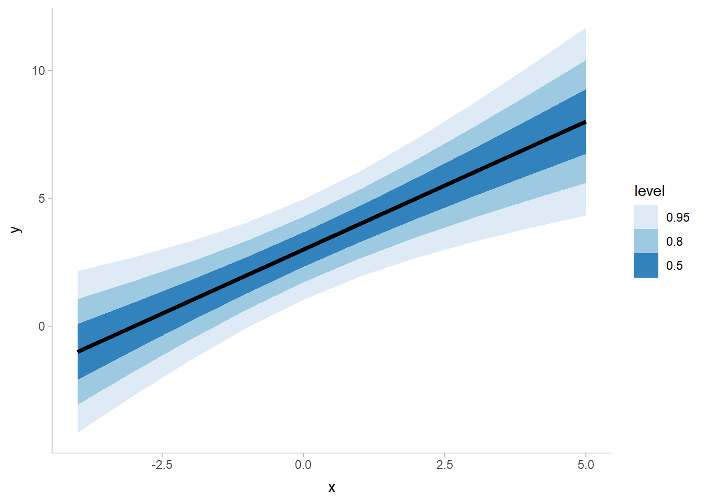
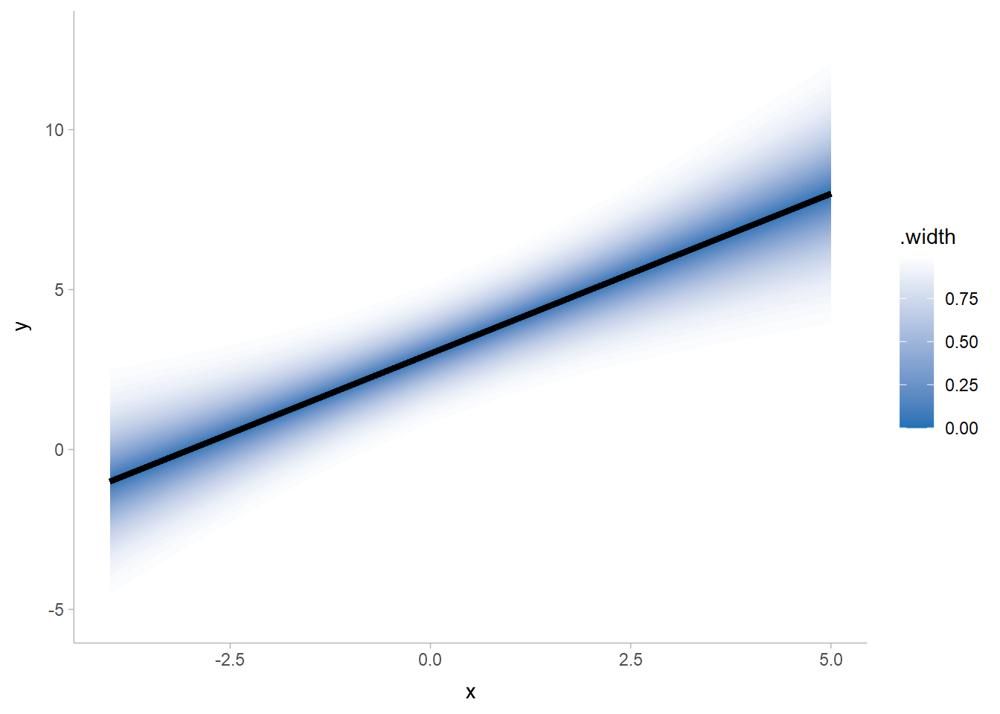
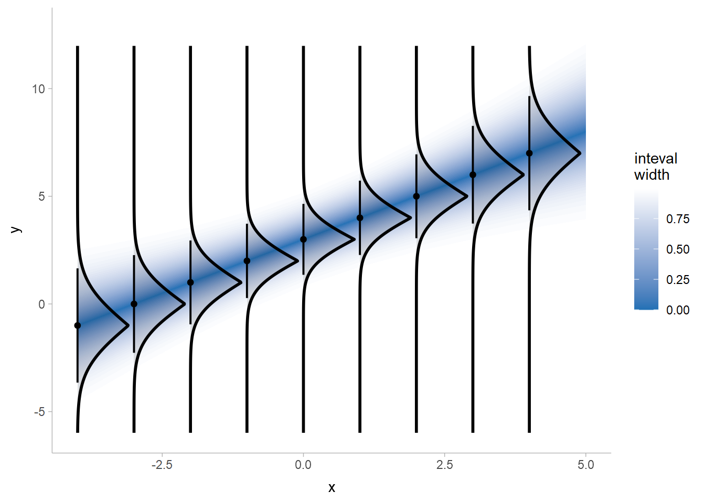
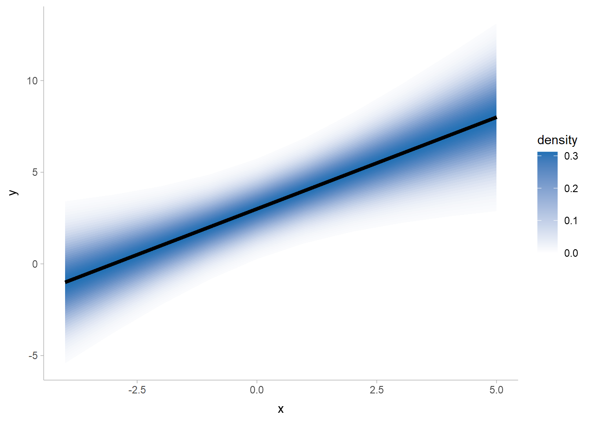
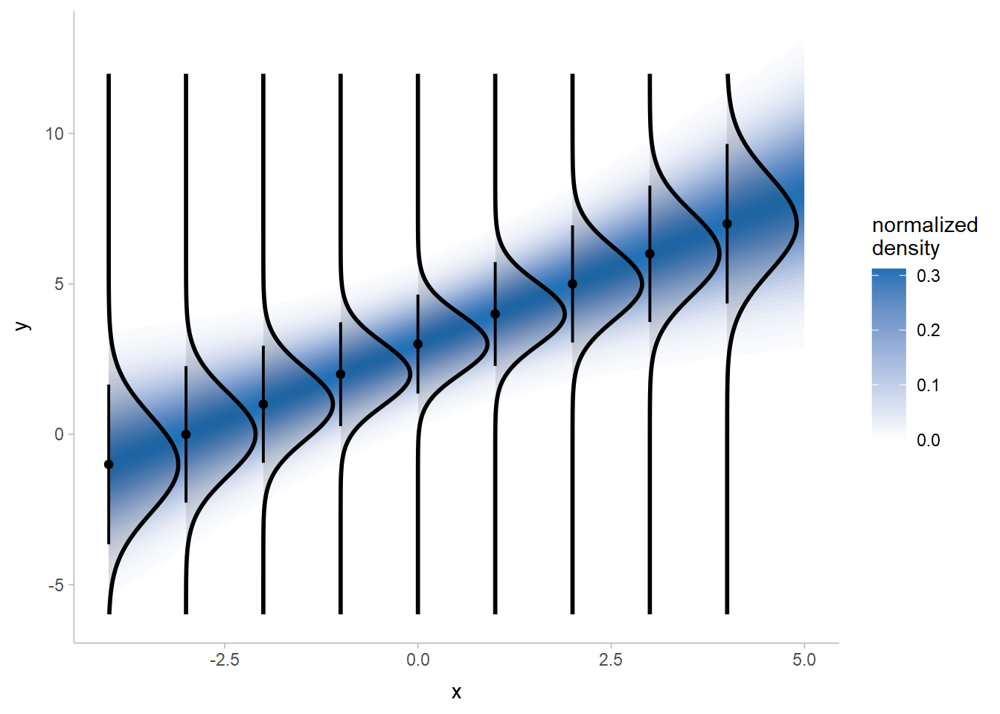
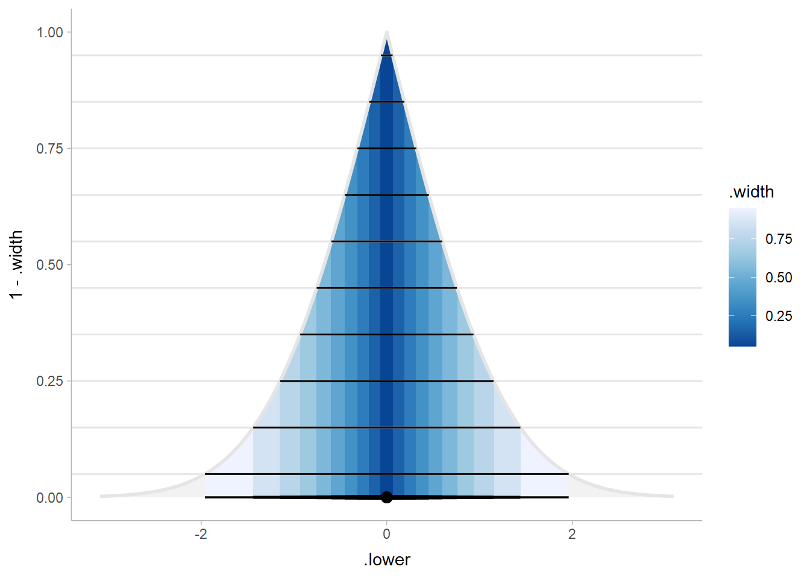
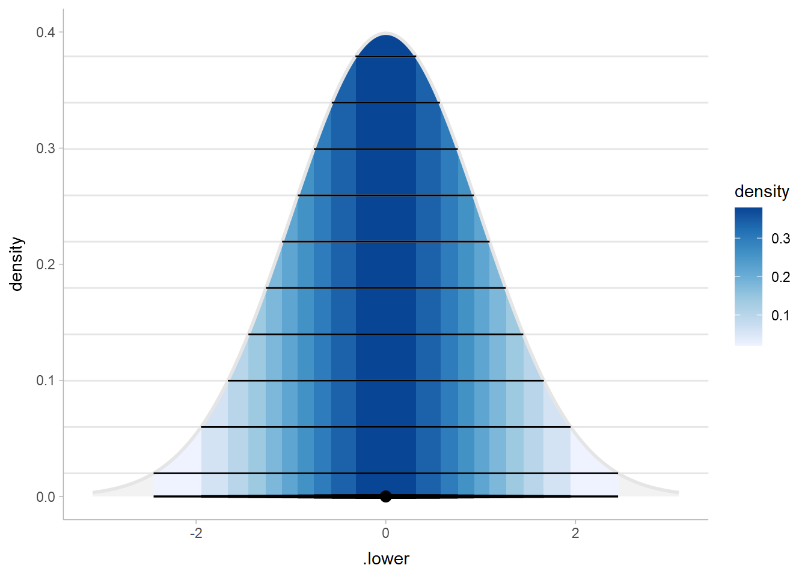

Fan charts versus density gradient lineribbons
================
Matthew Kay
2022-07-20

From on [this Twitter
thread](https://twitter.com/mjskay/status/1549602359046770688?s=20&t=YUvHrtaDhzGcADVMvKspRw)

## Setup

``` r
library(distributional)
library(ggplot2)
library(ggdist)
library(dplyr)

theme_set(theme_ggdist())
```

Make a simple dataset of to plot some lineribbons:

``` r
df = tibble(
  x = -4:5,
  y_mean = 3 + x,
  y_sd = sqrt(x^2/10 + 1),
  Y = dist_normal(y_mean, y_sd)
)
df
```

    ## # A tibble: 10 × 4
    ##        x y_mean  y_sd          Y
    ##    <int>  <dbl> <dbl>     <dist>
    ##  1    -4     -1  1.61 N(-1, 2.6)
    ##  2    -3      0  1.38  N(0, 1.9)
    ##  3    -2      1  1.18  N(1, 1.4)
    ##  4    -1      2  1.05  N(2, 1.1)
    ##  5     0      3  1       N(3, 1)
    ##  6     1      4  1.05  N(4, 1.1)
    ##  7     2      5  1.18  N(5, 1.4)
    ##  8     3      6  1.38  N(6, 1.9)
    ##  9     4      7  1.61  N(7, 2.6)
    ## 10     5      8  1.87  N(8, 3.5)

``` r
df |>
  ggplot(aes(x = x, ydist = Y)) +
  stat_lineribbon() +
  scale_fill_brewer()
```



## “fan chart” / “folded CDF” lineribbon

The basic version:

``` r
df |>
  ggplot(aes(x = x, ydist = Y)) +
  stat_lineribbon(
    aes(fill_ramp = stat(.width)), 
    .width = ppoints(50), fill = "#2171b5"
    ) +
  scale_fill_ramp_continuous(
    range = c(1, 0), guide = guide_rampbar(to = "#2171b5")
  )
```



The version annotated with the function in question, with line removed
for clarity:

``` r
df |>
  ggplot(aes(x = x, ydist = Y)) +
  stat_ribbon(
    aes(fill_ramp = stat(.width)), 
    .width = ppoints(50), fill = "#2171b5"
  ) +
  stat_halfeye(
    aes(thickness = stat(0.5 - abs(cdf - 0.5))), 
    fill = alpha("black", 0.1), slab_color = "black",
    .width = 0.9, interval_size = 1.5, 
    data = df[-nrow(df), ]
  ) +
  scale_fill_ramp_continuous(
    range = c(1, 0), guide = guide_rampbar(to = "#2171b5")
  ) +
  labs(fill_ramp = "inteval\nwidth")
```



This works because quantile intervals evenly spaced in terms of width
are horizontal cuts through the folded CDF.

## the density lineribbon

The basic version:

``` r
withr::with_options(list(ggdist.experimental.slab_data_in_intervals = TRUE), print(
  df |>
    ggplot(aes(x = x, ydist = Y)) +
    stat_lineribbon(
      aes(fill_ramp = stat(ave(pdf_min, .width))), 
      .width = pnorm(seq(-2.5, 2.5, length.out = 50)), fill = "#2171b5"
      ) +
    scale_fill_ramp_continuous(
      guide = guide_rampbar(to = "#2171b5")
    ) +
    labs(fill_ramp = "density")
))
```



The version annotated with the function in question, with line removed
for clarity:

``` r
withr::with_options(list(ggdist.experimental.slab_data_in_intervals = TRUE), print(
  df |>
    ggplot(aes(x = x, ydist = Y)) +
    stat_ribbon(
      aes(fill_ramp = stat(ave(pdf_min, .width))), 
      .width = pnorm(seq(-2.5, 2.5, length.out = 50)), fill = "#2171b5",
      point_interval = median_hdci
      ) +
    stat_halfeye(
      fill = alpha("black", 0.1), slab_color = "black",
      .width = 0.9, interval_size = 1.5, 
      data = df[-nrow(df), ],
      normalize = "groups",
      point_interval = median_hdci
    ) +
    scale_fill_ramp_continuous(
      guide = guide_rampbar(to = "#2171b5")
    ) +
    labs(fill_ramp = "normalized\ndensity")
))
```



## On a single distribution

To see the difference on single distribution, here’s the folded CDF with
quantile intervals:

``` r
interval_widths = ppoints(10, a = 0.5)

data.frame(X = dist_normal()) |>
  ggplot() +
  stat_halfeye(
    aes(xdist = X, fill = stat(.width), thickness = stat(1 - 2 * abs(cdf - 0.5))),
    .width = interval_widths,
    scale = 1,
    slab_color = "gray90"
  ) +
  geom_hline(
    aes(yintercept = 1 - .width), 
    data = \(d) median_qi(d, .width = interval_widths),
    color = "gray90"
  ) +
  geom_segment(
    aes(y = 1 - .width, x = .lower, xend = .upper, yend = 1 - .width), 
    data = \(d) median_qi(d, .width = interval_widths)
  ) +
  scale_fill_distiller(na.value = "gray95")
```



And the density version with HDIs (note b/c the Normal is symmetric in
this case since HDIs and QIs are the same):

``` r
inv_dnorm = function(d) -sqrt(-log(d * sqrt(2 * pi)) * 2)
interval_densities = ppoints(10, a = 0.5) * dnorm(0)
interval_widths = 1 - 2 * pnorm(inv_dnorm(interval_densities))

withr::with_options(list(ggdist.experimental.slab_data_in_intervals = TRUE), (
  p <<- data.frame(x = dist_normal()) |>
    ggplot() +
    stat_halfeye(
      aes(xdist = x, fill = stat(dnorm(qnorm((1 - .width) / 2)))),
      .width = interval_widths,
      scale = 1,
      normalize = "none",
      slab_color = "gray90"
    ) +
    geom_hline(
      yintercept = interval_densities,
      color = "gray90"
    ) +
    geom_segment(
      aes(y = dnorm(.lower), x = .lower, xend = .upper, yend = dnorm(.upper)), 
      data = \(d) median_qi(d, .width = interval_widths)
    ) +
    scale_fill_distiller(na.value = "gray95", direction = 1) +
    coord_cartesian(ylim = c(0, 0.4)) +
    labs(
      fill = "density",
      y = "density"
    )
))
```


