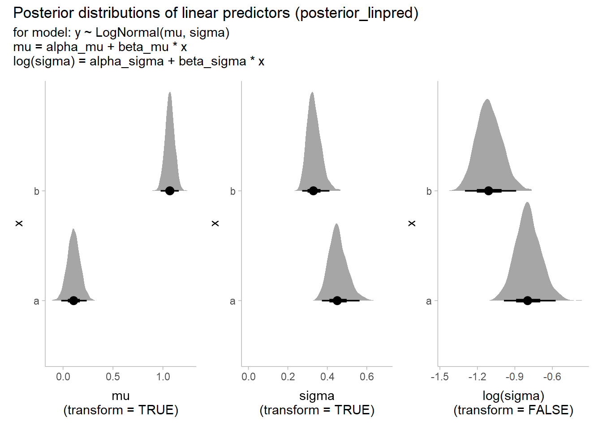
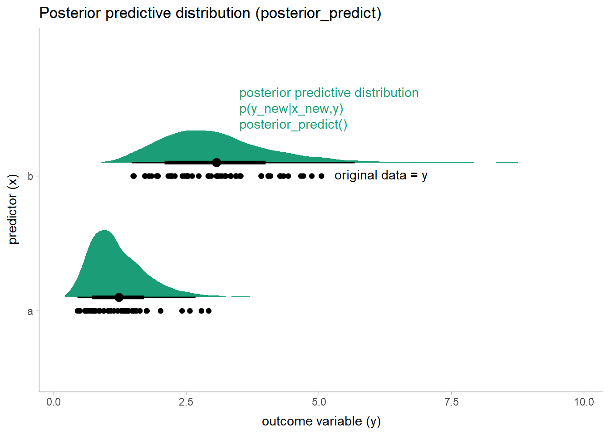

Posterior predictions, linear predictors, and means
================
Matthew Kay
2022-09-24

``` r
library(ggplot2)
library(brms)
library(tidybayes)
library(ggdist)
library(dplyr)
library(posterior)
library(patchwork)

theme_set(theme_ggdist())
```

## Data

We’ll generate some data with one categorical predictor (`x`) and an
outcome variable (`y`):

``` r
set.seed(12345)
df = data.frame(x = c("a","b"), y = rlnorm(100, c(0, 1), c(0.5, 0.25)))
```

It looks like this:

``` r
df |>
  ggplot(aes(y = x, x = y)) +
  geom_point()
```


## Model

We’ll fit a lognormal model to the data:

``` r
m = brm(bf(y ~ x, sigma ~ x), data = df, family = lognormal, backend = "cmdstanr", cores = 4, chains = 4, file = "linpred_epred_m.rds")
```

If `x = "b"` is encoded as
,
this model is as follows:

\\
\mu &= \alpha_\mu + \beta_\mu x\\
\log(\sigma) &= \alpha_\sigma + \beta_\sigma x
\end{align*}")

This model has:

-   Outcome variable
    
-   Predictor
    
-   Linear predictor
    
    with an identity link function
-   Linear predictor
    ")
    with a log link function

We can also define the mean of

as follows:

\\
&= \mathrm{exp}\left(\mu + \frac{\sigma^2}{2}\right)
\end{align*}")

That is,

is the mean of a lognormal distribution with parameters

and
.

## Things we can get from the model

### Posterior distribution

We could ask for the posterior for the variables in the model:

``` r
m |>
  gather_draws(`b_.*`, regex = TRUE) |>
  ggplot(aes(x = .value, y = .variable)) +
  stat_halfeye()
```


Here we have:

-   ")
    = `b_Intercept`
-   ")
    = `b_xb`
-   ")
    = `b_sigma_Intercept`
-   ")
    = `b_Intercept`

The posterior quantifies uncertainty in our model parameters given the
observed
.

### Posterior distribution of the linear predictors (`posterior_linpred()`)

We can also get the posterior for the linear predictors,

and
"),
either transformed or not.

``` r
df_new = data.frame(x = c("a", "b"))

# Could also do this using this tidybayes shortcut:
# df_new |> add_linpred_rvars(m, dpar = c("mu", "sigma"), transform = TRUE)
df_linpred_trans = df_new |>
  mutate(
    mu = rvar(posterior_linpred(m, newdata = df_new, dpar = "mu", transform = TRUE)),
    sigma = rvar(posterior_linpred(m, newdata = df_new, dpar = "sigma", transform = TRUE))
  )

df_linpred_trans
```

    ##   x                     mu                  sigma
    ## 1 a 0.1073847 ± 0.06411203 0.4548776 ± 0.04761424
    ## 2 b 1.0693297 ± 0.04631977 0.3327120 ± 0.03488217

Here we have:

-   The posterior distribution for the transformed linear predictor
    
    conditional on the new predictors
    (
    or `df_new`) and the data we observed originally
    ().
    This is
    ")
    = `posterior_linpred(m, df_new, dpar = "mu", transform = TRUE)`

-   The posterior distribution for the transformed linear predictor
    
    conditional on the new predictors
    (
    or `df_new`) and the data we observed originally
    ().
    This is
    ")
    = `posterior_linpred(m, df_new, dpar = "sigma", transform = TRUE)`

We could similarly get the untransformed linear predictors:

``` r
df_new = data.frame(x = c("a", "b"))

# Could also do this using this tidybayes shortcut:
# df_new |> add_linpred_rvars(m, dpar = c("mu", "sigma"), transform = FALSE)
df_linpred_untrans = df_new |>
  mutate(
    mu = rvar(posterior_linpred(m, newdata = df_new, dpar = "mu", transform = FALSE)),
    `log(sigma)` = rvar(posterior_linpred(m, newdata = df_new, dpar = "sigma", transform = FALSE))
  )

df_linpred_untrans
```

    ##   x                     mu             log(sigma)
    ## 1 a 0.1073847 ± 0.06411203 -0.7930788 ± 0.1030348
    ## 2 b 1.0693297 ± 0.04631977 -1.1058586 ± 0.1033407

Here we have:

-   The posterior distribution for the linear predictor
    
    conditional on the new predictors
    (
    or `df_new`) and the data we observed originally
    ().
    This is
    ")
    = `posterior_linpred(m, df_new, dpar = "mu", transform = FALSE)`.
    Because the link function for
    
    is the identity function, we get exactly the same result for
    `dpar = "mu"` regardless of `transform`.

-   The posterior distribution for the linear predictor
    ")
    conditional on the new predictors
    (
    or `df_new`) and the data we observed originally
    ().
    This is
    |x_\textrm{new},y)")
    = `posterior_linpred(m, df_new, dpar = "sigma", transform = FALSE)`

We could also plot these:

``` r
plot_mu = df |>
  ggplot(aes(y = x)) +
  stat_halfeye(aes(xdist = mu), data = df_linpred_trans) +
  xlab("mu\n(transform = TRUE or FALSE)")

plot_sigma = df |>
  ggplot(aes(y = x)) +
  stat_halfeye(aes(xdist = sigma), data = df_linpred_trans) +
  xlab("sigma\n(transform = TRUE)") +
  xlim(0,NA)

plot_log_sigma = df |>
  ggplot(aes(y = x)) +
  stat_halfeye(aes(xdist = `log(sigma)`), data = df_linpred_untrans) +
  xlab("log(sigma)\n(transform = FALSE)")

plot_mu + plot_sigma + plot_log_sigma +
  plot_annotation(
    title = "Posterior distributions of linear predictors (posterior_linpred)",
    subtitle = "for model: y ~ LogNormal(mu, sigma)\nmu = alpha_mu + beta_mu * x\nlog(sigma) = alpha_sigma + beta_sigma * x"
  )
```



We can see that while `log(sigma)` is unconstrained, `sigma` must always
be positive.

### Posterior predictive distribution (`posterior_predict()`)

We may also be interested in the uncertainty in new observations,
,
conditional on predictors,

(`df_new`). This is the posterior predictive distribution, available
with `posterior_predict()`:

``` r
# Could also do this using this tidybayes shortcut:
# df_new |> add_predicted_rvars(m)
df_pred = df_new |>
  mutate(
    y_new = rvar(posterior_predict(m, newdata = df_new))
  )

df_pred
```

    ##   x                y_new
    ## 1 a 1.231339 ± 0.5843741
    ## 2 b 3.072402 ± 1.0872871

Here we have:

-   The posterior predictive distribution new observations
    
    conditional on the new predictors
    (
    or `df_new`) and the data we observed originally
    ().
    This is
    ")
    = `posterior_predict(m, df_new)`.

We can compare this against the observed data and see the distribution
roughly matches the distribution of observed data (it better! the model
type we fit is the same as the model type used to generate the data):

``` r
plot_pred = df |>
  ggplot(aes(y = x)) +
  stat_halfeye(aes(xdist = y_new), data = df_pred, fill = "#1b9e77", point_interval = mean_qi, position = position_nudge(y = 0.1), scale = 0.5) +
  geom_point(aes(x = y)) +
  annotate("text", y = 2.35, x = 3.5, label = "posterior predictive distribution\np(y_new|x_new,y)\nposterior_predict()", color = "#1b9e77", hjust = 0, lineheight = 1, vjust = 0) +
  annotate("text", y = 2, x = max(df$y) + 0.25, label = "original data = y", hjust = 0, vjust = 0.35) +
  labs(
    x = "outcome variable (y)",
    y = "predictor (x)"
  )

plot_pred +
  ggtitle("Posterior predictive distribution (posterior_predict)")
```



Notice that these means do not match up with the values of
,
because

is *not* the mean of these distributions.

Also notice that while this plot includes the mean of the posterior
predictive distribution, the uncertainty being displayed is the
uncertainty in new observations
(),
*not* the uncertainty in the mean itself. For that, we need the
*distribution of the expectation* of the posterior predictive.

### Distribution of the expectation of the posterior predictive (`posterior_epred()`)

If we want the uncertainty in the means above, we first need to define
precisely what they are. If we have the definition of
")
from before, then we are looking for the posterior distribution for

conditional on the new predictors,

and the data already observed
(),
which is
")
= `posterior_epred(m, df_new)`:

``` r
# Could also do this using this tidybayes shortcut:
# df_new |> add_epred_rvars(m)
df_epred = df_new |>
  mutate(
    M = rvar(posterior_epred(m, newdata = df_new))
  )

df_epred
```

    ##   x                     M
    ## 1 a 1.238944 ± 0.08427582
    ## 2 b 3.084627 ± 0.14816418

Plotting this with the data:

``` r
plot_epred_pred = plot_pred +
  stat_halfeye(aes(xdist = M), data = df_epred, fill = "#d95f02", point_interval = mean_qi, position = position_nudge(y = -0.1), side = "bottom", scale = 0.5) +
  annotate("text", y = 1.85, x = 3.5, label = "distribution of the expectation of the posterior predictive\np(M|x_new,y) where M = E(y_new|mu,sigma)\nposterior_epred()", color = "#d95f02", hjust = 0, vjust = 1, lineheight = 1)

plot_epred_pred +
  labs(
    title = "posterior_predict versus posterior_epred",
    subtitle = "for model: y ~ LogNormal(mu, sigma)\nmu = alpha_mu + beta_mu * x\nlog(sigma) = alpha_sigma + beta_sigma * x"
  )
```


