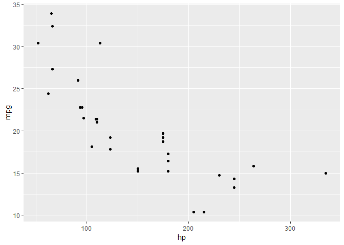
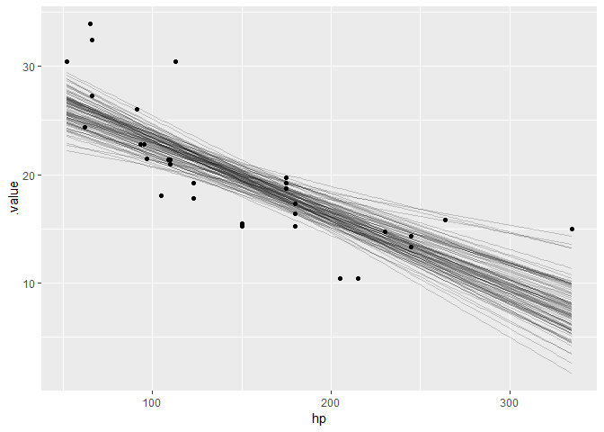
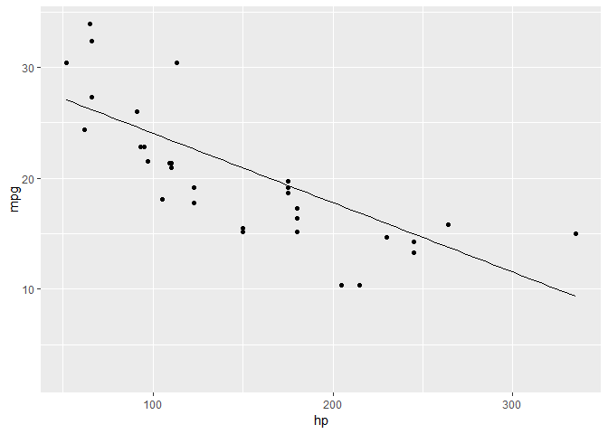
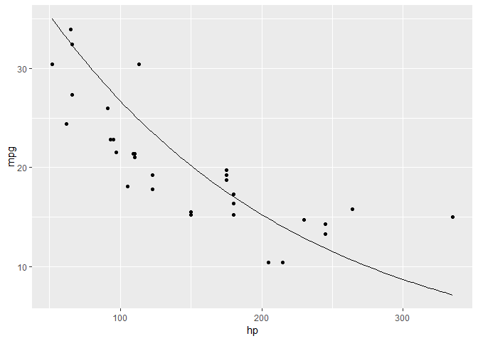
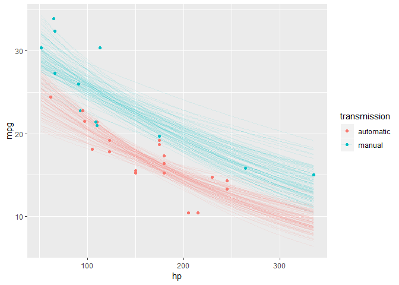
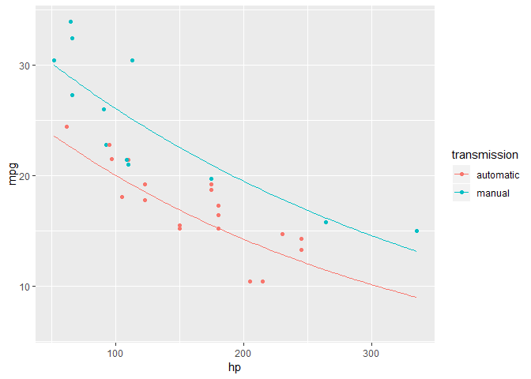

Uncertainty examples with mtcars
================

``` r
library(tidyverse)
```

    ## -- Attaching packages ------------------------------------------------------------------------------------------------------------ tidyverse 1.2.1 --

    ## v ggplot2 3.0.0     v purrr   0.2.5
    ## v tibble  1.4.2     v dplyr   0.7.6
    ## v tidyr   0.8.1     v stringr 1.3.1
    ## v readr   1.1.1     v forcats 0.3.0

    ## -- Conflicts --------------------------------------------------------------------------------------------------------------- tidyverse_conflicts() --
    ## x dplyr::filter() masks stats::filter()
    ## x dplyr::lag()    masks stats::lag()

``` r
library(modelr)
library(brms)
```

    ## Loading required package: Rcpp

    ## Loading 'brms' package (version 2.4.3). Useful instructions
    ## can be found by typing help('brms'). A more detailed introduction
    ## to the package is available through vignette('brms_overview').
    ## Run theme_set(theme_default()) to use the default bayesplot theme.

``` r
library(tidybayes)
```

    ## NOTE: As of tidybayes version 1.0, several functions, arguments, and output column names
    ##       have undergone significant name changes in order to adopt a unified naming scheme.
    ##       See help('tidybayes-deprecated') for more information.

``` r
library(gganimate)
```

``` r
mtcars %>%
  ggplot(aes(x = hp, y = mpg)) +
  geom_point()
```

<!-- -->

``` r
m_linear = brm(mpg ~ hp, data = mtcars)
```

    ## Compiling the C++ model

    ## Start sampling

    ## 
    ## SAMPLING FOR MODEL 'e778e59c9a60b2df0194f83a78cd996e' NOW (CHAIN 1).
    ## 
    ## Gradient evaluation took 0 seconds
    ## 1000 transitions using 10 leapfrog steps per transition would take 0 seconds.
    ## Adjust your expectations accordingly!
    ## 
    ## 
    ## Iteration:    1 / 2000 [  0%]  (Warmup)
    ## Iteration:  200 / 2000 [ 10%]  (Warmup)
    ## Iteration:  400 / 2000 [ 20%]  (Warmup)
    ## Iteration:  600 / 2000 [ 30%]  (Warmup)
    ## Iteration:  800 / 2000 [ 40%]  (Warmup)
    ## Iteration: 1000 / 2000 [ 50%]  (Warmup)
    ## Iteration: 1001 / 2000 [ 50%]  (Sampling)
    ## Iteration: 1200 / 2000 [ 60%]  (Sampling)
    ## Iteration: 1400 / 2000 [ 70%]  (Sampling)
    ## Iteration: 1600 / 2000 [ 80%]  (Sampling)
    ## Iteration: 1800 / 2000 [ 90%]  (Sampling)
    ## Iteration: 2000 / 2000 [100%]  (Sampling)
    ## 
    ##  Elapsed Time: 0.046 seconds (Warm-up)
    ##                0.035 seconds (Sampling)
    ##                0.081 seconds (Total)
    ## 
    ## 
    ## SAMPLING FOR MODEL 'e778e59c9a60b2df0194f83a78cd996e' NOW (CHAIN 2).
    ## 
    ## Gradient evaluation took 0 seconds
    ## 1000 transitions using 10 leapfrog steps per transition would take 0 seconds.
    ## Adjust your expectations accordingly!
    ## 
    ## 
    ## Iteration:    1 / 2000 [  0%]  (Warmup)
    ## Iteration:  200 / 2000 [ 10%]  (Warmup)
    ## Iteration:  400 / 2000 [ 20%]  (Warmup)
    ## Iteration:  600 / 2000 [ 30%]  (Warmup)
    ## Iteration:  800 / 2000 [ 40%]  (Warmup)
    ## Iteration: 1000 / 2000 [ 50%]  (Warmup)
    ## Iteration: 1001 / 2000 [ 50%]  (Sampling)
    ## Iteration: 1200 / 2000 [ 60%]  (Sampling)
    ## Iteration: 1400 / 2000 [ 70%]  (Sampling)
    ## Iteration: 1600 / 2000 [ 80%]  (Sampling)
    ## Iteration: 1800 / 2000 [ 90%]  (Sampling)
    ## Iteration: 2000 / 2000 [100%]  (Sampling)
    ## 
    ##  Elapsed Time: 0.056 seconds (Warm-up)
    ##                0.052 seconds (Sampling)
    ##                0.108 seconds (Total)
    ## 
    ## 
    ## SAMPLING FOR MODEL 'e778e59c9a60b2df0194f83a78cd996e' NOW (CHAIN 3).
    ## 
    ## Gradient evaluation took 0 seconds
    ## 1000 transitions using 10 leapfrog steps per transition would take 0 seconds.
    ## Adjust your expectations accordingly!
    ## 
    ## 
    ## Iteration:    1 / 2000 [  0%]  (Warmup)
    ## Iteration:  200 / 2000 [ 10%]  (Warmup)
    ## Iteration:  400 / 2000 [ 20%]  (Warmup)
    ## Iteration:  600 / 2000 [ 30%]  (Warmup)
    ## Iteration:  800 / 2000 [ 40%]  (Warmup)
    ## Iteration: 1000 / 2000 [ 50%]  (Warmup)
    ## Iteration: 1001 / 2000 [ 50%]  (Sampling)
    ## Iteration: 1200 / 2000 [ 60%]  (Sampling)
    ## Iteration: 1400 / 2000 [ 70%]  (Sampling)
    ## Iteration: 1600 / 2000 [ 80%]  (Sampling)
    ## Iteration: 1800 / 2000 [ 90%]  (Sampling)
    ## Iteration: 2000 / 2000 [100%]  (Sampling)
    ## 
    ##  Elapsed Time: 0.044 seconds (Warm-up)
    ##                0.061 seconds (Sampling)
    ##                0.105 seconds (Total)
    ## 
    ## 
    ## SAMPLING FOR MODEL 'e778e59c9a60b2df0194f83a78cd996e' NOW (CHAIN 4).
    ## 
    ## Gradient evaluation took 0 seconds
    ## 1000 transitions using 10 leapfrog steps per transition would take 0 seconds.
    ## Adjust your expectations accordingly!
    ## 
    ## 
    ## Iteration:    1 / 2000 [  0%]  (Warmup)
    ## Iteration:  200 / 2000 [ 10%]  (Warmup)
    ## Iteration:  400 / 2000 [ 20%]  (Warmup)
    ## Iteration:  600 / 2000 [ 30%]  (Warmup)
    ## Iteration:  800 / 2000 [ 40%]  (Warmup)
    ## Iteration: 1000 / 2000 [ 50%]  (Warmup)
    ## Iteration: 1001 / 2000 [ 50%]  (Sampling)
    ## Iteration: 1200 / 2000 [ 60%]  (Sampling)
    ## Iteration: 1400 / 2000 [ 70%]  (Sampling)
    ## Iteration: 1600 / 2000 [ 80%]  (Sampling)
    ## Iteration: 1800 / 2000 [ 90%]  (Sampling)
    ## Iteration: 2000 / 2000 [100%]  (Sampling)
    ## 
    ##  Elapsed Time: 0.045 seconds (Warm-up)
    ##                0.085 seconds (Sampling)
    ##                0.13 seconds (Total)

``` r
mtcars %>%
  data_grid(hp = seq_range(hp, n = 101)) %>%
  add_fitted_draws(m_linear, n = 100) %>%
  ggplot(aes(x = hp)) +
  geom_line(aes(y = .value, group = .draw), alpha = .2) +
  geom_point(aes(y = mpg), data = mtcars)
```

<!-- -->

``` r
mtcars %>%
  data_grid(hp = seq_range(hp, n = 101)) %>%
  add_fitted_draws(m_linear, n = 100) %>%
  ggplot(aes(x = hp, y = mpg)) +
  geom_line(aes(y = .value)) +
  geom_point(data = mtcars) +
  transition_manual(.draw)
```

<!-- -->

``` r
m_loglog = brm(mpg ~ hp, data = mtcars, family = lognormal)
```

    ## Compiling the C++ model

    ## Start sampling

    ## 
    ## SAMPLING FOR MODEL '023d89e0edb25f3b63be20b1b66051cd' NOW (CHAIN 1).
    ## 
    ## Gradient evaluation took 0 seconds
    ## 1000 transitions using 10 leapfrog steps per transition would take 0 seconds.
    ## Adjust your expectations accordingly!
    ## 
    ## 
    ## Iteration:    1 / 2000 [  0%]  (Warmup)
    ## Iteration:  200 / 2000 [ 10%]  (Warmup)
    ## Iteration:  400 / 2000 [ 20%]  (Warmup)
    ## Iteration:  600 / 2000 [ 30%]  (Warmup)
    ## Iteration:  800 / 2000 [ 40%]  (Warmup)
    ## Iteration: 1000 / 2000 [ 50%]  (Warmup)
    ## Iteration: 1001 / 2000 [ 50%]  (Sampling)
    ## Iteration: 1200 / 2000 [ 60%]  (Sampling)
    ## Iteration: 1400 / 2000 [ 70%]  (Sampling)
    ## Iteration: 1600 / 2000 [ 80%]  (Sampling)
    ## Iteration: 1800 / 2000 [ 90%]  (Sampling)
    ## Iteration: 2000 / 2000 [100%]  (Sampling)
    ## 
    ##  Elapsed Time: 0.19 seconds (Warm-up)
    ##                0.086 seconds (Sampling)
    ##                0.276 seconds (Total)
    ## 
    ## 
    ## SAMPLING FOR MODEL '023d89e0edb25f3b63be20b1b66051cd' NOW (CHAIN 2).
    ## 
    ## Gradient evaluation took 0 seconds
    ## 1000 transitions using 10 leapfrog steps per transition would take 0 seconds.
    ## Adjust your expectations accordingly!
    ## 
    ## 
    ## Iteration:    1 / 2000 [  0%]  (Warmup)
    ## Iteration:  200 / 2000 [ 10%]  (Warmup)
    ## Iteration:  400 / 2000 [ 20%]  (Warmup)
    ## Iteration:  600 / 2000 [ 30%]  (Warmup)
    ## Iteration:  800 / 2000 [ 40%]  (Warmup)
    ## Iteration: 1000 / 2000 [ 50%]  (Warmup)
    ## Iteration: 1001 / 2000 [ 50%]  (Sampling)
    ## Iteration: 1200 / 2000 [ 60%]  (Sampling)
    ## Iteration: 1400 / 2000 [ 70%]  (Sampling)
    ## Iteration: 1600 / 2000 [ 80%]  (Sampling)
    ## Iteration: 1800 / 2000 [ 90%]  (Sampling)
    ## Iteration: 2000 / 2000 [100%]  (Sampling)
    ## 
    ##  Elapsed Time: 0.238 seconds (Warm-up)
    ##                0.104 seconds (Sampling)
    ##                0.342 seconds (Total)
    ## 
    ## 
    ## SAMPLING FOR MODEL '023d89e0edb25f3b63be20b1b66051cd' NOW (CHAIN 3).
    ## 
    ## Gradient evaluation took 0 seconds
    ## 1000 transitions using 10 leapfrog steps per transition would take 0 seconds.
    ## Adjust your expectations accordingly!
    ## 
    ## 
    ## Iteration:    1 / 2000 [  0%]  (Warmup)
    ## Iteration:  200 / 2000 [ 10%]  (Warmup)
    ## Iteration:  400 / 2000 [ 20%]  (Warmup)
    ## Iteration:  600 / 2000 [ 30%]  (Warmup)
    ## Iteration:  800 / 2000 [ 40%]  (Warmup)
    ## Iteration: 1000 / 2000 [ 50%]  (Warmup)
    ## Iteration: 1001 / 2000 [ 50%]  (Sampling)
    ## Iteration: 1200 / 2000 [ 60%]  (Sampling)
    ## Iteration: 1400 / 2000 [ 70%]  (Sampling)
    ## Iteration: 1600 / 2000 [ 80%]  (Sampling)
    ## Iteration: 1800 / 2000 [ 90%]  (Sampling)
    ## Iteration: 2000 / 2000 [100%]  (Sampling)
    ## 
    ##  Elapsed Time: 0.264 seconds (Warm-up)
    ##                0.095 seconds (Sampling)
    ##                0.359 seconds (Total)
    ## 
    ## 
    ## SAMPLING FOR MODEL '023d89e0edb25f3b63be20b1b66051cd' NOW (CHAIN 4).
    ## 
    ## Gradient evaluation took 0 seconds
    ## 1000 transitions using 10 leapfrog steps per transition would take 0 seconds.
    ## Adjust your expectations accordingly!
    ## 
    ## 
    ## Iteration:    1 / 2000 [  0%]  (Warmup)
    ## Iteration:  200 / 2000 [ 10%]  (Warmup)
    ## Iteration:  400 / 2000 [ 20%]  (Warmup)
    ## Iteration:  600 / 2000 [ 30%]  (Warmup)
    ## Iteration:  800 / 2000 [ 40%]  (Warmup)
    ## Iteration: 1000 / 2000 [ 50%]  (Warmup)
    ## Iteration: 1001 / 2000 [ 50%]  (Sampling)
    ## Iteration: 1200 / 2000 [ 60%]  (Sampling)
    ## Iteration: 1400 / 2000 [ 70%]  (Sampling)
    ## Iteration: 1600 / 2000 [ 80%]  (Sampling)
    ## Iteration: 1800 / 2000 [ 90%]  (Sampling)
    ## Iteration: 2000 / 2000 [100%]  (Sampling)
    ## 
    ##  Elapsed Time: 0.208 seconds (Warm-up)
    ##                0.099 seconds (Sampling)
    ##                0.307 seconds (Total)

``` r
mtcars %>%
  data_grid(hp = seq_range(hp, n = 101)) %>%
  add_fitted_draws(m_loglog, n = 100) %>%
  ggplot(aes(x = hp, y = mpg)) +
  geom_line(aes(y = .value)) +
  geom_point(data = mtcars) +
  transition_manual(.draw)
```

<!-- -->

``` r
mtcars_clean = mtcars %>%
  mutate(transmission = factor(am, labels = c("automatic", "manual")))

m_loglog_trans = brm(mpg ~ hp * transmission, data = mtcars_clean, family = lognormal)
```

    ## Compiling the C++ model

    ## recompiling to avoid crashing R session

    ## Start sampling

    ## 
    ## SAMPLING FOR MODEL '023d89e0edb25f3b63be20b1b66051cd' NOW (CHAIN 1).
    ## 
    ## Gradient evaluation took 0 seconds
    ## 1000 transitions using 10 leapfrog steps per transition would take 0 seconds.
    ## Adjust your expectations accordingly!
    ## 
    ## 
    ## Iteration:    1 / 2000 [  0%]  (Warmup)
    ## Iteration:  200 / 2000 [ 10%]  (Warmup)
    ## Iteration:  400 / 2000 [ 20%]  (Warmup)
    ## Iteration:  600 / 2000 [ 30%]  (Warmup)
    ## Iteration:  800 / 2000 [ 40%]  (Warmup)
    ## Iteration: 1000 / 2000 [ 50%]  (Warmup)
    ## Iteration: 1001 / 2000 [ 50%]  (Sampling)
    ## Iteration: 1200 / 2000 [ 60%]  (Sampling)
    ## Iteration: 1400 / 2000 [ 70%]  (Sampling)
    ## Iteration: 1600 / 2000 [ 80%]  (Sampling)
    ## Iteration: 1800 / 2000 [ 90%]  (Sampling)
    ## Iteration: 2000 / 2000 [100%]  (Sampling)
    ## 
    ##  Elapsed Time: 0.506 seconds (Warm-up)
    ##                0.241 seconds (Sampling)
    ##                0.747 seconds (Total)
    ## 
    ## 
    ## SAMPLING FOR MODEL '023d89e0edb25f3b63be20b1b66051cd' NOW (CHAIN 2).
    ## 
    ## Gradient evaluation took 0 seconds
    ## 1000 transitions using 10 leapfrog steps per transition would take 0 seconds.
    ## Adjust your expectations accordingly!
    ## 
    ## 
    ## Iteration:    1 / 2000 [  0%]  (Warmup)
    ## Iteration:  200 / 2000 [ 10%]  (Warmup)
    ## Iteration:  400 / 2000 [ 20%]  (Warmup)
    ## Iteration:  600 / 2000 [ 30%]  (Warmup)
    ## Iteration:  800 / 2000 [ 40%]  (Warmup)
    ## Iteration: 1000 / 2000 [ 50%]  (Warmup)
    ## Iteration: 1001 / 2000 [ 50%]  (Sampling)
    ## Iteration: 1200 / 2000 [ 60%]  (Sampling)
    ## Iteration: 1400 / 2000 [ 70%]  (Sampling)
    ## Iteration: 1600 / 2000 [ 80%]  (Sampling)
    ## Iteration: 1800 / 2000 [ 90%]  (Sampling)
    ## Iteration: 2000 / 2000 [100%]  (Sampling)
    ## 
    ##  Elapsed Time: 0.508 seconds (Warm-up)
    ##                0.191 seconds (Sampling)
    ##                0.699 seconds (Total)
    ## 
    ## 
    ## SAMPLING FOR MODEL '023d89e0edb25f3b63be20b1b66051cd' NOW (CHAIN 3).
    ## 
    ## Gradient evaluation took 0 seconds
    ## 1000 transitions using 10 leapfrog steps per transition would take 0 seconds.
    ## Adjust your expectations accordingly!
    ## 
    ## 
    ## Iteration:    1 / 2000 [  0%]  (Warmup)
    ## Iteration:  200 / 2000 [ 10%]  (Warmup)
    ## Iteration:  400 / 2000 [ 20%]  (Warmup)
    ## Iteration:  600 / 2000 [ 30%]  (Warmup)
    ## Iteration:  800 / 2000 [ 40%]  (Warmup)
    ## Iteration: 1000 / 2000 [ 50%]  (Warmup)
    ## Iteration: 1001 / 2000 [ 50%]  (Sampling)
    ## Iteration: 1200 / 2000 [ 60%]  (Sampling)
    ## Iteration: 1400 / 2000 [ 70%]  (Sampling)
    ## Iteration: 1600 / 2000 [ 80%]  (Sampling)
    ## Iteration: 1800 / 2000 [ 90%]  (Sampling)
    ## Iteration: 2000 / 2000 [100%]  (Sampling)
    ## 
    ##  Elapsed Time: 0.397 seconds (Warm-up)
    ##                0.175 seconds (Sampling)
    ##                0.572 seconds (Total)
    ## 
    ## 
    ## SAMPLING FOR MODEL '023d89e0edb25f3b63be20b1b66051cd' NOW (CHAIN 4).
    ## 
    ## Gradient evaluation took 0 seconds
    ## 1000 transitions using 10 leapfrog steps per transition would take 0 seconds.
    ## Adjust your expectations accordingly!
    ## 
    ## 
    ## Iteration:    1 / 2000 [  0%]  (Warmup)
    ## Iteration:  200 / 2000 [ 10%]  (Warmup)
    ## Iteration:  400 / 2000 [ 20%]  (Warmup)
    ## Iteration:  600 / 2000 [ 30%]  (Warmup)
    ## Iteration:  800 / 2000 [ 40%]  (Warmup)
    ## Iteration: 1000 / 2000 [ 50%]  (Warmup)
    ## Iteration: 1001 / 2000 [ 50%]  (Sampling)
    ## Iteration: 1200 / 2000 [ 60%]  (Sampling)
    ## Iteration: 1400 / 2000 [ 70%]  (Sampling)
    ## Iteration: 1600 / 2000 [ 80%]  (Sampling)
    ## Iteration: 1800 / 2000 [ 90%]  (Sampling)
    ## Iteration: 2000 / 2000 [100%]  (Sampling)
    ## 
    ##  Elapsed Time: 0.488 seconds (Warm-up)
    ##                0.191 seconds (Sampling)
    ##                0.679 seconds (Total)

``` r
mtcars_clean %>%
  data_grid(hp = seq_range(hp, n = 101), transmission) %>%
  add_fitted_draws(m_loglog_trans, n = 100) %>%
  ggplot(aes(x = hp, y = mpg, color = transmission)) +
  geom_line(aes(y = .value, group = paste(transmission, .draw)), alpha = .1) +
  geom_point(data = mtcars_clean)
```

<!-- -->

``` r
mtcars_clean %>%
  data_grid(hp = seq_range(hp, n = 101), transmission) %>%
  add_fitted_draws(m_loglog_trans, n = 100) %>%
  ggplot(aes(x = hp, y = mpg, color = transmission)) +
  geom_line(aes(y = .value)) +
  geom_point(data = mtcars_clean) +
  transition_manual(.draw)
```

<!-- -->
