Multivariate regression
================

  - [Setup](#setup)
      - [Data](#data)
      - [Data plot](#data-plot)
      - [Model](#model)
      - [Correlations from the model](#correlations-from-the-model)
      - [Altogether](#altogether)
      - [Or side-by-side](#or-side-by-side)
      - [More heatmap-y](#more-heatmap-y)
  - [Okay, but does it scale?](#okay-but-does-it-scale)
      - [Density version](#density-version)
      - [Dither approach](#dither-approach)
      - [Densities with heatmaps?](#densities-with-heatmaps)
  - [The no-uncertainty heatmap](#the-no-uncertainty-heatmap)
  - [Posterior predictions](#posterior-predictions)
  - [The directly-in-Stan model](#the-directly-in-stan-model)
      - [Posterior predictions](#posterior-predictions-1)

## Setup

Libraries that might be of help:

``` r
library(tidyverse)
library(magrittr)
library(ggplot2)
library(rstan)
library(brms)
library(modelr)
library(tidybayes)
library(ggridges)
library(colorspace)
library(patchwork)  # devtools::install_github("thomasp85/patchwork")

theme_set(theme_light())
rstan_options(auto_write = TRUE)
options(mc.cores = parallel::detectCores())
```

### Data

``` r
set.seed(1234)

df =  tibble(
  y1 = rnorm(20),
  y2 = rnorm(20, y1),
  y3 = rnorm(20, -y1)
)
```

### Data plot

``` r
df %>%
  gather(.variable, .value) %>%
  gather_pairs(.variable, .value) %>%
  ggplot(aes(.x, .y)) +
  geom_point() +
  facet_grid(.row ~ .col)
```

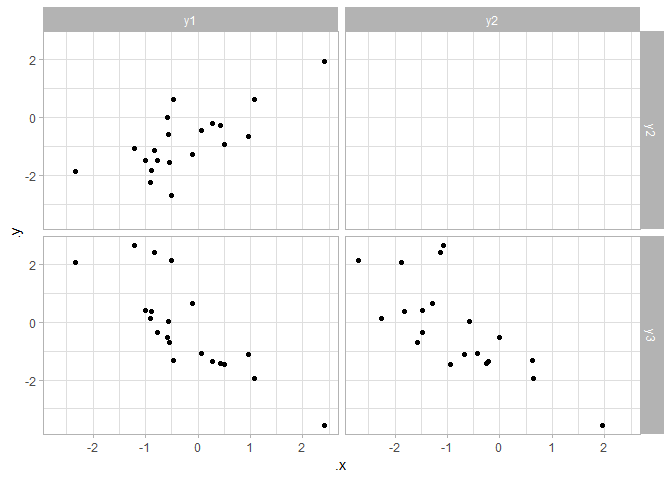<!-- -->

### Model

``` r
m = brm(mvbind(y1, y2, y3) ~ 0 + intercept, data = df)
```

    ## Setting 'rescor' to TRUE by default for this model

    ## Compiling the C++ model

    ## Start sampling

### Correlations from the model

A plot of the `rescor` coefficients from the model:

``` r
m %>%
  gather_draws(`rescor.*`, regex = TRUE) %>%
  separate(.variable, c(".rescor", ".row", ".col"), sep = "__") %>%
  ggplot(aes(x = .value, y = 0)) +
  geom_halfeyeh() +
  xlim(c(-1, 1)) +
  xlab("rescor") +
  ylab(NULL) +
  facet_grid(.row ~ .col)
```

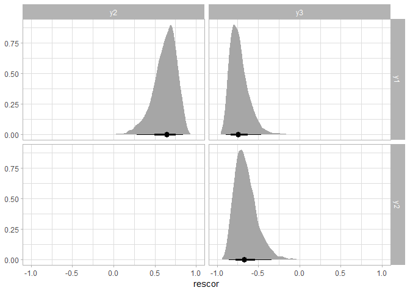<!-- -->

### Altogether

I’m not sure I like this (we’re kind of streching the limits of
`facet_grid` here…) but if you absolutely must have a combined plot,
this sort of thing could work…

``` r
correlations = m %>%
  gather_draws(`rescor.*`, regex = TRUE) %>%
  separate(.variable, c(".rescor", ".row", ".col"), sep = "__")


df %>%
  gather(.variable, .value) %>%
  gather_pairs(.variable, .value) %>%
  ggplot(aes(.x, .y)) +
  
  # scatterplots
  geom_point() +

  # correlations
  geom_halfeyeh(aes(x = .value, y = 0), data = correlations, size = .75) +
  geom_vline(aes(xintercept = x), data = correlations %>% data_grid(nesting(.row, .col), x = c(-1, 0, 1))) +

  facet_grid(.row ~ .col)
```

<!-- -->

### Or side-by-side

Actually, it occurs to me that the traditional “flipped on the axis”
double-scatterplot-matrix can be hard to read, because it is hard to
mentally do the diagonal-mirroring operation to figure out which cell on
one side goes with the other. I find it easier to just map from the same
cell in one matrix onto another, which suggests something like this
might be better:

``` r
data_plot = df %>%
  gather(.variable, .value) %>%
  gather_pairs(.variable, .value) %>%
  ggplot(aes(.x, .y)) +
  geom_point(size = 1.5) +
  facet_grid(.row ~ .col) +
  theme(panel.grid.minor = element_blank()) +
  xlab(NULL)+ 
  ylab(NULL)

rescor_plot = m %>%
  gather_draws(`rescor.*`, regex = TRUE) %>%
  separate(.variable, c(".rescor", ".col", ".row"), sep = "__") %>%
  ggplot(aes(x = .value, y = 0)) +
  geom_halfeyeh() +
  xlim(c(-1, 1)) +
  xlab("rescor") +
  ylab(NULL) +
  facet_grid(.row ~ .col) +
  xlab("correlation") +
  scale_y_continuous(breaks = NULL) 

data_plot + rescor_plot
```

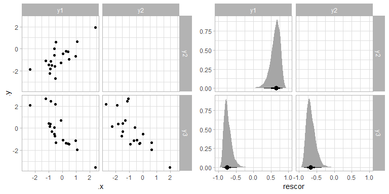<!-- -->

### More heatmap-y

Some other things possibly worth improving:

  - adding a color encoding back in for that high-level gist
  - making “up” be positive correlation and “down” be negative
  - 0 line

<!-- end list -->

``` r
rescor_plot_heat = m %>%
  gather_draws(`rescor.*`, regex = TRUE) %>%
  separate(.variable, c(".rescor", ".col", ".row"), sep = "__") %>%
  ggplot(aes(x = .value, y = 0)) +
  geom_density_ridges_gradient(aes(fill = stat(x)), color = NA) +
  geom_vline(xintercept = 0, color = "gray65", linetype = "dashed") +
  stat_pointintervalh() +
  xlim(c(-1, 1)) +
  xlab("correlation") +
  ylab(NULL) +
  scale_y_continuous(breaks = NULL) +
  scale_fill_continuous_diverging(palette = "Green-Brown", limits = c(-1, 1), guide = FALSE) +
  #scale_fill_continuous_diverging(palette = "Blue-Yellow 2", limits = c(-1, 1), guide = FALSE) +
  #scale_fill_distiller(type = "div", palette = "RdBu", direction = 1, limits = c(-1, 1), guide = FALSE) +
  coord_flip() +
  facet_grid(.row ~ .col)

data_plot + rescor_plot_heat
```

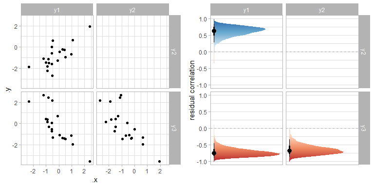<!-- -->

## Okay, but does it scale?

Let’s add some more variables…

``` r
set.seed(1234)

df_large =  tibble(
  y1 = rnorm(20),
  y2 = rnorm(20, y1),
  y3 = rnorm(20, -y1),
  y4 = rnorm(20, 0.5 * y1),
  y5 = rnorm(20),
  y6 = rnorm(20, -.25 * y1),
  y7 = rnorm(20, -y5),
  y8 = rnorm(20, -0.5 * y5)
)
```

``` r
data_plot_large = df_large %>%
  gather(.variable, .value) %>%
  gather_pairs(.variable, .value) %>%
  ggplot(aes(.x, .y)) +
  geom_point(size = .5) +
  facet_grid(.row ~ .col) +
  theme(panel.grid.minor = element_blank()) +
  xlab(NULL) +
  ylab(NULL)

data_plot_large
```

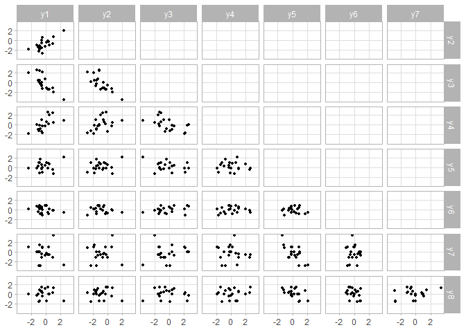<!-- -->

``` r
m_large = brm(mvbind(y1, y2, y3, y4, y5, y6, y7, y8) ~ 1, data = df_large)
```

    ## Setting 'rescor' to TRUE by default for this model

    ## Compiling the C++ model

    ## Start sampling

### Density version

I’ve dropped the intervals for this (they start to become illegible) and
did a few other minor tweaks for clarity:

``` r
rescor_plot_heat_large = m_large %>%
  gather_draws(`rescor.*`, regex = TRUE) %>%
  separate(.variable, c(".rescor", ".col", ".row"), sep = "__") %>%
  ggplot(aes(x = .value, y = 0)) +
  geom_density_ridges_gradient(aes(fill = stat(x)), color = NA) +
  geom_vline(xintercept = 0, color = "white", size = 1) +
  xlim(c(-1, 1)) +
  xlab("correlation") +
  ylab(NULL) +
  scale_y_continuous(breaks = NULL) +
  scale_x_continuous(breaks = NULL) +
  scale_fill_continuous_diverging(palette = "Green-Brown", limits = c(-1, 1), guide = FALSE) +
  #scale_fill_distiller(type = "div", palette = "RdBu", direction = 1, limits = c(-1, 1), guide = FALSE) +
  coord_flip() +
  facet_grid(.row ~ .col)

data_plot_large + rescor_plot_heat_large
```

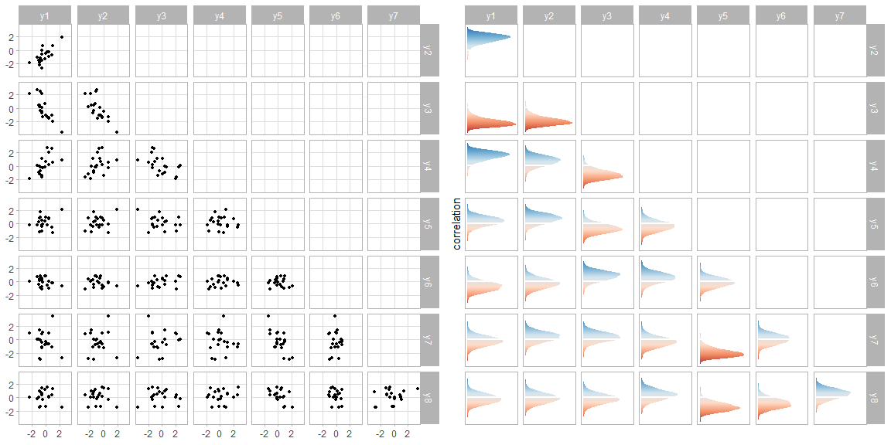<!-- -->

You can still pick out the high/low correlations by color, though it
isn’t quite as easy.

### Dither approach

A different, more frequency-framing approach, would be to use dithering
to show uncertainty (see e.g. Figure 4 from [this
paper](http://doi.wiley.com/10.1002/sta4.150)). This is akin to
something like an icon array. You should still be able to see the
average color (thanks to the human visual system’s ensembling
processing), but also get a sense of the uncertainty by how “dithered” a
square looks:

``` r
w = 60
h = 60

rescor_plot_heat_dither = m_large %>%
  gather_draws(`rescor.*`, regex = TRUE) %>%
  separate(.variable, c(".rescor", ".col", ".row"), sep = "__") %>%
  group_by(.row, .col) %>%
  summarise(
    .value = list(sample(.value, w * h)),
    x = list(rep(1:w, times = h)),
    y = list(rep(1:h, each = w))
  ) %>%
  unnest() %>%
  ggplot(aes(x, y, fill = .value)) +
  geom_raster() +
  facet_grid(.row ~ .col) +
  scale_fill_continuous_diverging(palette = "Green-Brown", limits = c(-1, 1), guide = FALSE) +
  #scale_fill_continuous_diverging(palette = "Blue-Yellow 2", limits = c(-1, 1), guide = FALSE) +
  #scale_fill_distiller(type = "div", palette = "RdBu", direction = 1, limits = c(-1, 1), name = "corr.") +
  scale_y_continuous(breaks = NULL) +
  scale_x_continuous(breaks = NULL) +
  xlab(NULL) +
  ylab(NULL) +
  coord_cartesian(expand = FALSE)

data_plot_large + rescor_plot_heat_dither
```

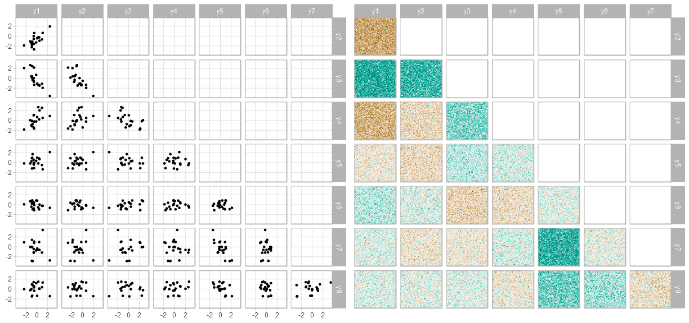<!-- -->

### Densities with heatmaps?

Going back to densities, what if the point estimate is used to set the
cell backgorund — maybe that will help that format have a high-level
gist while retaining its more accurate depiction of the uncertainty:

``` r
rescor_plot_heat_large = m_large %>%
  gather_draws(`rescor.*`, regex = TRUE) %>%
  separate(.variable, c(".rescor", ".col", ".row"), sep = "__") %>%
  ggplot(aes(x = .value, y = 0)) +
  geom_tile(aes(x = 0, y = 0.5, width = 2, height = 1, fill = .value),
    data = function(df) df %>% group_by(.row, .col) %>% median_qi(.value)) +
  geom_density_ridges_gradient(aes(height = stat(ndensity), fill = stat(x)), color = NA, scale = 1) +
  geom_vline(xintercept = 0, color = "white", alpha = .5) +
  geom_density_ridges(aes(height = stat(ndensity)), fill = NA, color = "gray50", scale = 1) +
  xlim(c(-1, 1)) +
  xlab("correlation") +
  ylab(NULL) +
  scale_y_continuous(breaks = NULL) +
  scale_x_continuous(breaks = NULL) +
  scale_fill_distiller(type = "div", palette = "RdBu", direction = 1, limits = c(-1, 1), guide = FALSE) +
  coord_flip(expand = FALSE) +
  facet_grid(.row ~ .col)

data_plot_large + rescor_plot_heat_large
```

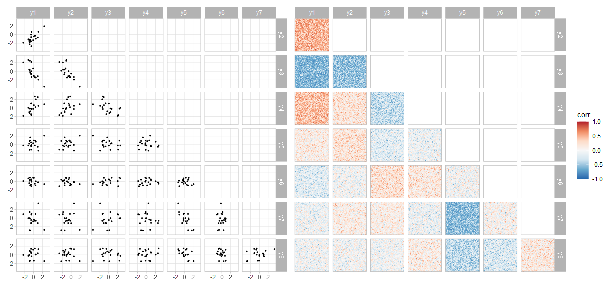<!-- -->

This is, admittedly, a bit weird…

## The no-uncertainty heatmap

For reference:

``` r
rescor_plot_heat_large = m_large %>%
  gather_draws(`rescor.*`, regex = TRUE) %>%
  separate(.variable, c(".rescor", ".col", ".row"), sep = "__") %>%
  group_by(.row, .col) %>% 
  median_qi(.value) %>%
  ggplot(aes(x = 0, y = 0, fill = .value)) +
  geom_raster() +
  xlab("correlation") +
  ylab(NULL) +
  scale_y_continuous(breaks = NULL) +
  scale_x_continuous(breaks = NULL) +
  scale_fill_distiller(type = "div", palette = "RdBu", direction = 1, limits = c(-1, 1), guide = FALSE) +
  coord_flip(expand = FALSE) +
  facet_grid(.row ~ .col)

data_plot_large + rescor_plot_heat_large
```

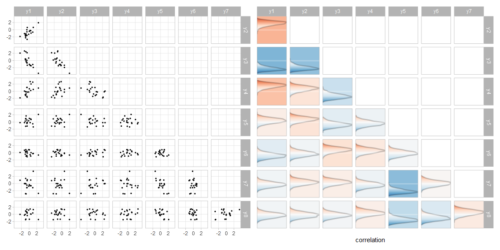<!-- -->

## Posterior predictions

Let’s look at some posterior predictions as well:

``` r
data.frame(x = 0) %>%
  add_predicted_draws(m_large) %>%
  ungroup() %>%
  select(-.row) %>%
  gather_pairs(.category, .prediction) %>%
  ggplot(aes(x = .x, y = .y)) +
  stat_density_2d(alpha = 1/15, fill = "#08519C", geom = "polygon") +
  geom_point(data = df_large %>% gather_variables() %>% gather_pairs(.variable, .value), size = .5, pch = 20) +
  scale_fill_distiller(direction = 1, guide = FALSE) +
  facet_grid(.row ~ .col)
```

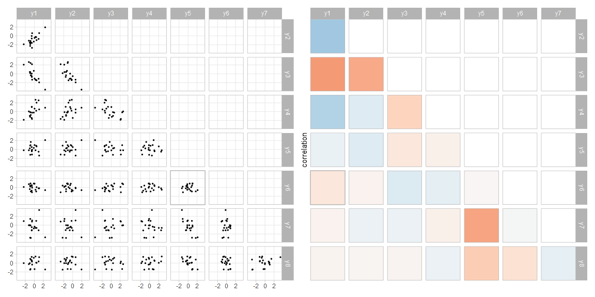<!-- -->

## The directly-in-Stan model

To demo some other useful `tidybayes` features, particularly on nested
data, let’s code up a version of the multivariate regression model
directly in Stan that expects the outcome variable `Y` to be a vector:

``` stan
data {
  int<lower=1> n;            // number of observations
  int<lower=1> n_responses;  // number of response variables
  vector[n_responses] Y[n];  // response matrix
}
parameters {
  vector[n_responses] Mu;
  vector<lower=0>[n_responses] sigma;
  // parameters for multivariate linear models
  cholesky_factor_corr[n_responses] Lrescor;
}
transformed parameters {
  matrix[n_responses, n_responses] LSigma = diag_pre_multiply(sigma, Lrescor);
}
model {
  // priors
  sigma ~ student_t(3, 0, 10);
  Mu ~ normal(0, 10);
  Lrescor ~ lkj_corr_cholesky(1);
  
  // likelihood
  Y ~ multi_normal_cholesky(Mu, LSigma);
} 
generated quantities {
  matrix[n_responses, n_responses] Sigma = multiply_lower_tri_self_transpose(LSigma);
}
```

We’ll use a modified version of the dataset that has the data nested
into a `Y` variable as well:

``` r
nested_df = df %>%
  transmute(Y = pmap(list(y1, y2, y3), c))

nested_df
```

    ## # A tibble: 20 x 1
    ##    Y        
    ##    <list>   
    ##  1 <dbl [3]>
    ##  2 <dbl [3]>
    ##  3 <dbl [3]>
    ##  4 <dbl [3]>
    ##  5 <dbl [3]>
    ##  6 <dbl [3]>
    ##  7 <dbl [3]>
    ##  8 <dbl [3]>
    ##  9 <dbl [3]>
    ## 10 <dbl [3]>
    ## 11 <dbl [3]>
    ## 12 <dbl [3]>
    ## 13 <dbl [3]>
    ## 14 <dbl [3]>
    ## 15 <dbl [3]>
    ## 16 <dbl [3]>
    ## 17 <dbl [3]>
    ## 18 <dbl [3]>
    ## 19 <dbl [3]>
    ## 20 <dbl [3]>

We’ll also keep the long-form paired version of the dataset around since
it will be useful for plotting:

``` r
paired_df = df %>%
  gather(.variable, .value) %>%
  gather_pairs(.variable, .value) 

paired_df %>%
  ggplot(aes(.x, .y)) +
  geom_point() +
  facet_grid(.row ~ .col)
```

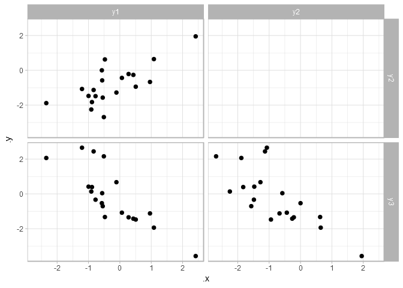<!-- -->

To prepare the data for modeling, we can use `compose_data()`, which
will appropriately handle the nested `Y` column for us, generate the `n`
column, and let us easily generate an `n_responses` column (the number
of responses in each vector in `Y`):

``` r
data_for_stan = nested_df %>%
  compose_data(n_responses = length(Y[[1]]))
```

Then we can fit the model:

``` r
mv = sampling(mv_stanmodel, data = data_for_stan, chains = 4, iter = 5000)
```

### Posterior predictions

What we’d really like to be able to do is easily make use of the `Mu`
vector and `Sigma` matrix from the posterior draws. The latest version
of `tidybayes` now supports extracting variables as *nested* list
columns: any dimension you specify as a `.` is nested into the resulting
data frame rather than being moved into a separate column. For example:

``` r
mv %>%
  spread_draws(Mu[.], Sigma[.,.]) %>%
  head(10)
```

    ## # A tibble: 10 x 5
    ##    .chain .iteration .draw Mu        Sigma            
    ##     <int>      <int> <int> <list>    <list>           
    ##  1      1          1     1 <dbl [3]> <dbl[,3] [3 x 3]>
    ##  2      1          2     2 <dbl [3]> <dbl[,3] [3 x 3]>
    ##  3      1          3     3 <dbl [3]> <dbl[,3] [3 x 3]>
    ##  4      1          4     4 <dbl [3]> <dbl[,3] [3 x 3]>
    ##  5      1          5     5 <dbl [3]> <dbl[,3] [3 x 3]>
    ##  6      1          6     6 <dbl [3]> <dbl[,3] [3 x 3]>
    ##  7      1          7     7 <dbl [3]> <dbl[,3] [3 x 3]>
    ##  8      1          8     8 <dbl [3]> <dbl[,3] [3 x 3]>
    ##  9      1          9     9 <dbl [3]> <dbl[,3] [3 x 3]>
    ## 10      1         10    10 <dbl [3]> <dbl[,3] [3 x 3]>

This means we can use the `map()` family of functions from `purrr` to
directly make use of posterior draws from the `Mu` vector and the
`Sigma` covariance matrix; for example, we can generate posterior
predictions by taking draws from a multivariate normal simply by passing
`Mu` and `Sigma` onto the existing `MASS::mvrnorm()` function without
much additional fuss:

``` r
mv %>%
  spread_draws(Mu[.], Sigma[.,.]) %>%
  mutate(
    .variable = list(paste0("y", 1:3)),
    .prediction = map2(Mu, Sigma, MASS::mvrnorm, n = 1)
  ) %>%
  unnest(.variable, .prediction) %>%
  gather_pairs(.variable, .prediction) %>%
  ggplot(aes(x = .x, y = .y)) +
  stat_bin_hex(bins = 25) +
  geom_point(data = paired_df, pch = 21, fill = "white") +
  scale_fill_distiller(direction = 1, guide = FALSE) +
  facet_grid(.row ~ .col)
```

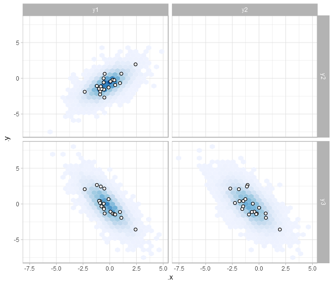<!-- -->

We could also show something from the means at the same time:

``` r
draws = mv %>%
  spread_draws(Mu[.], Sigma[.,.]) %>%
  mutate(
    .variable = list(paste0("y", 1:3)),
    .prediction = map2(Mu, Sigma, MASS::mvrnorm, n = 1)
  )
  
predictions = draws %>%
  unnest(.variable, .prediction) %>%
  gather_pairs(.variable, .prediction)

means = draws %>%
  unnest(.variable, Mu) %>%
  gather_pairs(.variable, Mu)

predictions %>%
  ggplot(aes(x = .x, y = .y)) +
  stat_bin_hex(bins = 25) +
  stat_ellipse(data = means) +
  stat_ellipse(data = means, level = .66) +
  geom_point(data = paired_df, pch = 21, fill = "white") +
  scale_fill_distiller(direction = 1, guide = FALSE) +
  facet_grid(.row ~ .col)
```

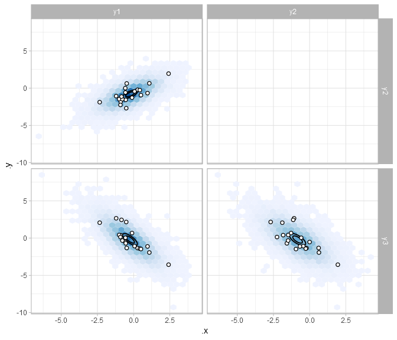<!-- -->
