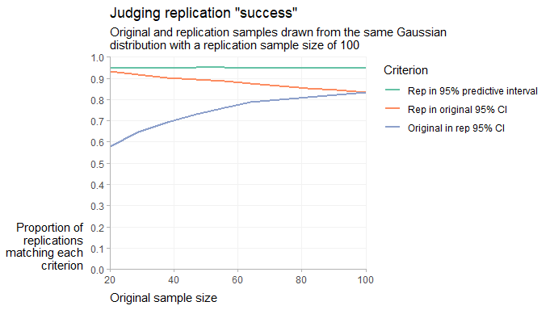

Replication prediction intervals
================
Matthew Kay
12/7/2021

## Setup

Libraries needed:

``` r
library(ggplot2)
library(purrr)
library(dplyr)
library(tidyr)
library(forcats)
library(broom)
library(ggdist)
```

## Data generation

We’ll generate data from a bunch of hypothetical original experiments
(orig) and replications (rep) and then calculate three replication
criteria:

-   Is the replication effect in the 95% CI of the original?
-   Is the original effect in the 95% CI of the replication?
-   Is the replication effect in the 95% prediction interval of the
    original?

We’ll do this at several sample sizes, always assuming the replication
has a sample size of 100 (for simplicity):

``` r
set.seed(1234)

exp_per_sample_size = 10000
sample_size = round(seq(20, 100, length.out = 10))
rep_sample_size = 100

results = expand.grid(
  exp = 1:exp_per_sample_size,
  sample_size = sample_size
) %>%
  # convert to tibble so that nested data frames don't complain
  as_tibble() %>%
  # generate data
  mutate(
    orig = map_dfr(sample_size, \(n) {
      x = rnorm(n)
      result = tidy(t.test(x))
      # add on replication prediction intervals
      # (Spence and Stanley 2016, https://doi.org/10.1371/journal.pone.0162874)
      var = var(x)
      pi_plusminus = qt(.975, n - 1) * sqrt(var/n + var/rep_sample_size)
      result %>% mutate(
        pi.low = estimate - pi_plusminus,
        pi.high = estimate + pi_plusminus
      )
    }),
    rep = map_dfr(sample_size, \(n) tidy(t.test(rnorm(rep_sample_size))))
  ) %>%
  # calculate the three criteria
  mutate(
    rep_in_orig = orig$conf.low <= rep$estimate & rep$estimate <= orig$conf.high,
    orig_in_rep = rep$conf.low <= orig$estimate & orig$estimate <= rep$conf.high,
    rep_in_pi = orig$pi.low <= rep$estimate & rep$estimate <= orig$pi.high
  ) 

results_summary = results %>%
  group_by(sample_size) %>%
  summarise(across(rep_in_orig:rep_in_pi, mean))

results_summary
```

    ## # A tibble: 10 x 4
    ##    sample_size rep_in_orig orig_in_rep rep_in_pi
    ##          <dbl>       <dbl>       <dbl>     <dbl>
    ##  1          20       0.931       0.579     0.952
    ##  2          29       0.918       0.647     0.949
    ##  3          38       0.901       0.692     0.949
    ##  4          47       0.894       0.729     0.95 
    ##  5          56       0.888       0.761     0.950
    ##  6          64       0.875       0.787     0.949
    ##  7          73       0.864       0.801     0.949
    ##  8          82       0.851       0.810     0.946
    ##  9          91       0.845       0.823     0.948
    ## 10         100       0.832       0.834     0.950

Plotting these, if criteria that are well-calibrated should be at 95%
and not be sensitive to sample size:

``` r
results_summary %>%
  pivot_longer(rep_in_orig:rep_in_pi, names_to = "Criterion", values_to = "proportion") %>%
  mutate(Criterion = fct_rev(fct_recode(Criterion, 
    "Original in rep 95% CI" = "orig_in_rep",
    "Rep in original 95% CI" = "rep_in_orig",
    "Rep in 95% predictive interval" = "rep_in_pi"
  ))) %>%
  ggplot(aes(x = sample_size, y = proportion, color = Criterion)) +
  geom_line(size = 1) +
  xlab("Original sample size") +
  ylab("Proportion of\nreplications\nmatching each\ncriterion") +
  ggtitle(
    'Judging replication "success"',
    'Original and replication samples drawn from the same Gaussian\ndistribution with a replication sample size of 100') +
  scale_y_continuous(limits = c(0, 1), breaks = seq(0, 1, by = 0.1)) +
  theme_ggdist() +
  axis_titles_bottom_left() +
  theme(
    axis.title.y = element_text(hjust = 1),
    panel.grid.major = element_line(color = "gray95"),
    legend.justification = c(0,1)
  ) +
  coord_cartesian(expand = FALSE, clip = "off") +
  scale_color_brewer(palette = "Set2")
```

<!-- -->

We can see that the only one that we can consistently judge replication
success with is whether the replication effect is in the 95% predictive
interval.
