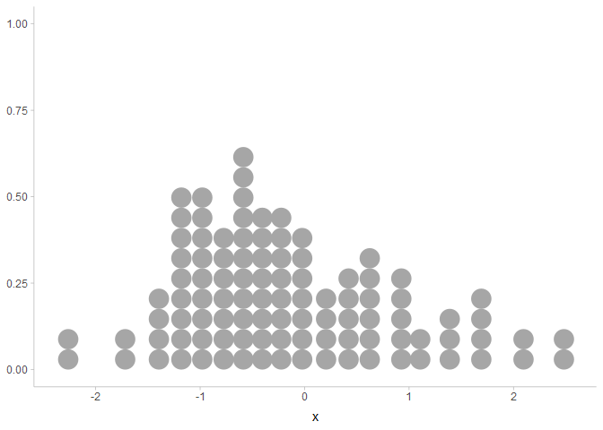
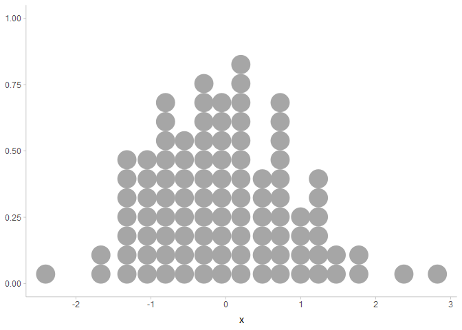
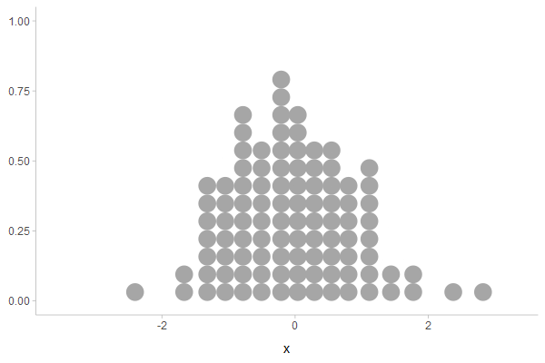
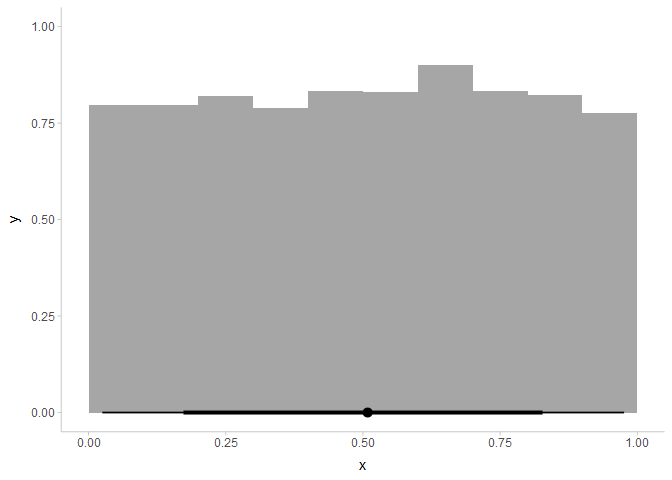
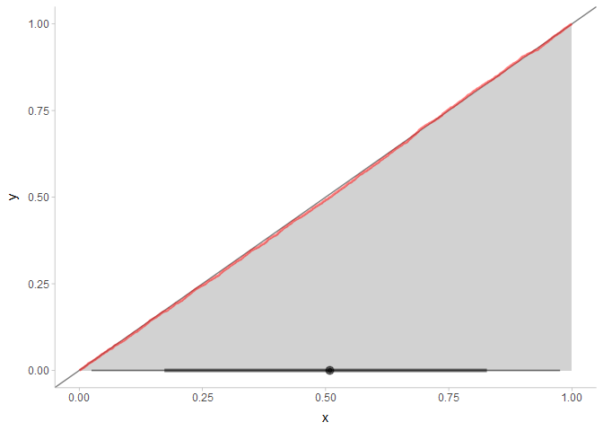
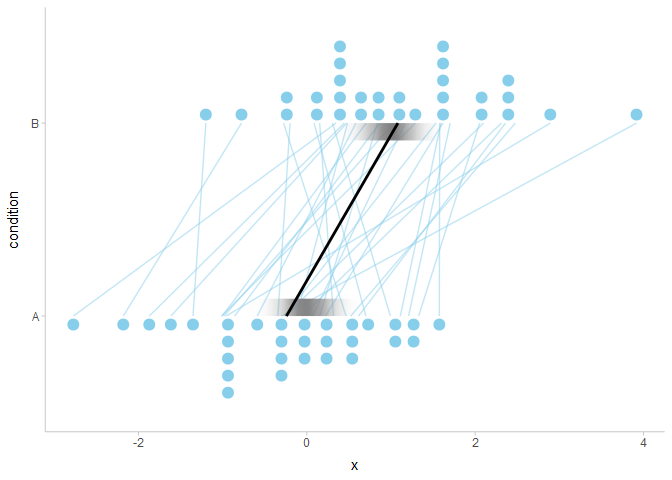
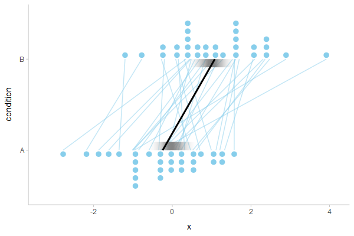

Simulating data with posterior::rvar
================
Matthew Kay
12/27/2021

## Introduction

This document demonstrates some features of the `posterior::rvar()`
random variable datatype, how to simulate data with it, and how to
visualize random variables using
[ggdist](https://mjskay.github.io/ggdist). It also shows some useful
bits of
[distributional](https://pkg.mitchelloharawild.com/distributional/),
[tidybayes](https://mjskay.github.io/tidybayes/), and
[gganimate](https://gganimate.com/) along the way.

## Setup

These packages are needed:

``` r
library(ggplot2)
library(dplyr)
library(tidyr)
library(distributional)
library(posterior)
library(tidybayes)
library(gganimate)

# I am using the dev version of ggdist. You may need to use
# devtools::install_github("mjskay/ggdist") to install it
# if version 3.1 is not on CRAN when you are reading this:
library(ggdist)

theme_set(theme_ggdist())
```

## A single dataset

### Generating the data

Before jumping into `rvar`, let’s simulate a single dataset the
traditional way in R, using one of the `r` functions. For simplicity,
we’ll do 100 draws from a Normal(0,1) distribution:

``` r
set.seed(1234)  # for reproducibility

n = 100
x = rnorm(n, mean = 0, sd = 1)

str(x)
```

    ##  num [1:100] -1.207 0.277 1.084 -2.346 0.429 ...

Which we might visualize with a dotplot. We’ll use
`ggdist::geom_dots()`, which automatically picks a dot size so that the
dotplot fits in the plot region:

``` r
tibble(x = x) %>%
  ggplot(aes(x = x)) +
  geom_dots()
```

<!-- -->

### Basic statistics

If we wanted to we could calculate the mean, variance, and standard
deviation of x as well:

``` r
mean_x = mean(x)
var_x = var(x)
sd_x = sd(x)

cat(sep = "",
  "mean:     ", mean_x, "\n",
  "variance: ", var_x, "\n",
  "sd:       ", sd_x, "\n"
)
```

    ## mean:     -0.1567617
    ## variance: 1.00883
    ## sd:       1.004405

We see that the values come out as approximately 0 and 1, as they
should.

### P values

If operating in a frequentist mode, we might also be interested in the
outcome of some statistical test; say a t-test for the null hypothesis
that the mean is 0. In this case, since we generated the data, we *know*
that the mean is 0, but once we generate many datasets like the one
above we might be interested in whether or not this particular
statistical test is well behaved (e.g. that its distribution of p values
is uniform), so we’ll demo calculating the p value in the individual
case as well.

First, we’ll calculate the p value using `t.test()`, then we’ll do it
manually (as this will come in handy later).

Using `t.test()`:

``` r
t.test(x)
```

    ## 
    ##  One Sample t-test
    ## 
    ## data:  x
    ## t = -1.5607, df = 99, p-value = 0.1218
    ## alternative hypothesis: true mean is not equal to 0
    ## 95 percent confidence interval:
    ##  -0.35605755  0.04253406
    ## sample estimates:
    ##  mean of x 
    ## -0.1567617

The p value itself is `t.test(x)$p.value`:

``` r
pvalue = t.test(x)$p.value
pvalue
```

    ## [1] 0.1217758

We can also calculate this manually using the standard error of the
mean, (*SE* = *SD*/sqrt(*n*)), and the degrees of freedom
(*DF* = 1 − *n*) along with a scaled-and-shifted Student’s t
distribution (provided by `ggdist::pstudent_t()` — one could also
manually scale and shift the standard Student’s t distribution provided
with `stats::pt()`, but I find the method below nicer because of its
connection to confidence distributions):

``` r
se_mean_x = sd_x / sqrt(n)
df_x = n - 1

2 * pstudent_t(-abs(mean_x), df = df_x, mu = 0, sigma = se_mean_x)
```

    ## [1] 0.1217758

### Confidence intervals

Speaking of confidence distributions, we could also use the confidence
distribution for the mean to calculate the lower and upper bounds of a
95% confidence interval on the mean…

``` r
confidence = 0.95
alpha = 1 - confidence

lower = qstudent_t(alpha/2, df = df_x, mu = mean_x, sigma = se_mean_x)
upper = qstudent_t(confidence + alpha/2, df = df_x, mu = mean_x, sigma = se_mean_x)

cat("95% CI for mean(x): [", lower, ",", upper, "]\n")
```

    ## 95% CI for mean(x): [ -0.3560575 , 0.04253406 ]

And then we can ask, is the true mean in the interval?

``` r
zero_in_interval = lower <= 0 & 0 <= upper

zero_in_interval
```

    ## [1] TRUE

We lucked out this time: the true mean (zero) is in the interval. Of
course, it might not have been — given our data generating process, 5%
of the time the mean should be outside of intervals calculated this way.

## A single dataset, many times

Of course, if we’re working in a frequentist mode, we’d really like to
ask all of the above questions with the qualifier, “… if we repeated
this a very large number of times.” Then the questions become things
like, “does the 95% CI contain the true mean 95% of the time?” and “are
the p values uniformly distributed?”

To do this in R, typically you will see people create large matrices or
data frames of many simulations from the same data generating process,
and then summarize those objects down. Instead, for this demo we will
use `posterior::rvar()` objects, and attempt to keep the code as close
as possible to looking like the original code above.

### Generating the data

For the single dataset we used an `r` function, i.e. `rnorm()`, which is
a built-in random number generator in R.

The [posterior](https://mc-stan.org/posterior/) package provides a way
to generate random variable datatypes using the built-in `r` functions,
by passing them as the first argument to `posterior::rvar_rng()`. The
remaining arguments are passed to the underlying `r` function, except
that instead of generating only `n = 100` values, `rvar_rng()` will
generate *n* × *k* values for some value of `k` (by default `4000`, set
by `options("posterior.rvar_ndraws")`) and return the result as an
`rvar()`.

Thus, where before we had a `numeric` vector of length `100`, now we
have an `rvar` vector of length `100`, with `4000` draws per element:

``` r
set.seed(1234)  # for reproducibility

n = 100
# compare to before: x = rnorm(n, mean = 0, sd = 1)
x = rvar_rng(rnorm, n, mean = 0, sd = 1)

str(x)
```

    ##  rvar<4000>[100]   0.0018 ± 1.00   0.0116 ± 0.99   0.0164 ± 0.99  -0.0231 ± 1.00 ...

We could visualize 100 datapoints from one version of `x` by using
`unnest_rvars()` on a data frame containing x. This will return a long
format data frame with a `.draw` column indexing the draws from `x`:

``` r
tibble(x = x) %>%
  tidybayes::unnest_rvars()
```

    ## # A tibble: 400,000 x 4
    ##         x .chain .iteration .draw
    ##     <dbl>  <int>      <int> <int>
    ##  1 -1.21       1          1     1
    ##  2  0.277      1          2     2
    ##  3  1.08       1          3     3
    ##  4 -2.35       1          4     4
    ##  5  0.429      1          5     5
    ##  6  0.506      1          6     6
    ##  7 -0.575      1          7     7
    ##  8 -0.547      1          8     8
    ##  9 -0.564      1          9     9
    ## 10 -0.890      1         10    10
    ## # ... with 399,990 more rows

We can select one draw from `x`, which will consist of 100 rows (i.e. a
single draw from the distribution of a 100-element vector), and
visualize it with a dotplot as before:

``` r
tibble(x = x) %>%
  tidybayes::unnest_rvars() %>%
  filter(.draw == 1) %>%
  ggplot(aes(x = x)) +
  geom_dots()
```

<!-- -->

We could also use animation to see what several such 100-element vectors
might look like, by selecting (say) 20 draws and using
`gganimate::transition_manual()` to animate over them:

``` r
p = tibble(x = x) %>%
  tidybayes::unnest_rvars() %>%
  filter(.draw <= 20) %>%
  ggplot(aes(x = x)) +
  geom_dots() +
  gganimate::transition_manual(.draw)

gganimate::animate(p, type = "cairo", width = 600, height = 400, res = 100)
```

    ## nframes and fps adjusted to match transition

<!-- -->

### Basic statistics

As before, we could calculate the mean, variance, and standard deviation
of `x`. Except now, we can calculate these as random variables by using
`rvar_`-prefixed functions from `posterior`, yielding *distributions* of
means, variances, and sds:

``` r
mean_x = rvar_mean(x)
var_x = rvar_var(x)
sd_x = rvar_sd(x)

cat(sep = "",
  "mean:     ", format(mean_x), "\n",
  "variance: ", format(var_x), "\n",
  "sd:       ", format(sd_x), "\n"
)
```

    ## mean:     0.0016 ± 0.099
    ## variance: 1 ± 0.14
    ## sd:       1 ± 0.072

We see that the values come out as approximately 0 and 1, but now we can
also see their uncertainty from repeated sampling.

We can visualize the three statistics using stats from the
[slab+interval](https://mjskay.github.io/ggdist/articles/slabinterval.html)
family of stats in {ggdist}. These stats (like `ggdist::stat_halfeye()`,
below) accept `posterior::rvar()` objects on their `xdist` or `ydist`
aesthetics, which are alternatives to `x` and `y` aesthetics that ggdist
geoms can use with `rvar`s or
[distributional](https://pkg.mitchelloharawild.com/distributional/)
objects:

``` r
tibble(
  stat = c("mean", "var", "sd"),
  value = c(mean_x, var_x, sd_x)
) %>%
  ggplot(aes(y = stat, xdist = value)) +
  stat_halfeye()
```

<!-- -->

In fact, we could even compare them against their theoretical
distributions:

-   variance should be Gamma(*n*/2,*n*/(2*σ*<sup>2</sup>)) using a
    shape, rate parameterization
-   standard deviation should be
    sqrt(Gamma(*n*/2,*n*/(2*σ*<sup>2</sup>)))
-   mean should be Normal(0,*σ*/sqrt(*n*))

We can construct all of the above distributions using
[distributional](https://pkg.mitchelloharawild.com/distributional/)
objects. For the distribution of the standard deviation, which is the
square root of a Gamma distribution, we’ll use
`distributional::dist_transformed()`, which can construct a transformed
distribution so long as you supply it with the transformation and its
inverse:

``` r
var_dist = dist_gamma(n/2, n/2)
sd_dist = dist_transformed(var_dist, sqrt, inverse = \(x) x^2)
mean_dist = dist_normal(0, 1/sqrt(n))
```

To make it easier to compare the theoretical distributions (`mean_dist`,
…) and the sampled distributions (`mean_x`, …), we’ll create a data
frame with a single list-column called `value` which contains both the
theoretical distributional objects and the sampled `rvar`s:

``` r
stat_comp_df = tibble(
  stat = rep(c("mean", "var", "sd"), 2),
  which = rep(c("theoretical", "sampled"), each = 3),
  value = list(
    mean_dist, var_dist, sd_dist,
    mean_x, var_x, sd_x
  )
)

stat_comp_df
```

    ## # A tibble: 6 x 3
    ##   stat  which       value     
    ##   <chr> <chr>       <list>    
    ## 1 mean  theoretical <dist [1]>
    ## 2 var   theoretical <dist [1]>
    ## 3 sd    theoretical <dist [1]>
    ## 4 mean  sampled     <rvar [1]>
    ## 5 var   sampled     <rvar [1]>
    ## 6 sd    sampled     <rvar [1]>

We can then compare these in a single plot, as both distributional
objects and `rvar`s (and lists of both) can be mapped onto `xdist` /
`ydist` aesthetics in `ggdist`:

``` r
stat_comp_df %>%
  ggplot(aes(y = stat, xdist = value, color = which)) +
  stat_slab(fill = NA, alpha = 0.5) 
```

<!-- -->

And we can see that the sampling distributions of these three statistics
match their theoretical distributions.

### P values

Calculating the p value for the null hypothesis that the mean is 0 as a
random variable is a bit more complicated, because unlike mean
(`rvar_mean()`) or variance (`rvar_var()`), `posterior` does not already
have functions to do this for us. We’ll demonstrate two ways to solve
the problem.

#### The slow way

The slow way would be to apply the `t.test()` function within every one
of the 4000 draws of `x` (each draw containing 100 data points). We can
do this by using `rfun()`, which converts an existing function (which
should return a `numeric` vector) into a function that can take `rvar`
objects, applies itself over every draw of those objects, and returns a
new `rvar` vector with the results:

``` r
rvar_ttest = rfun(\(x) t.test(x)$p.value)

pvalue = rvar_ttest(x)
pvalue
```

    ## rvar<4000>[1] mean ± sd:
    ## [1] 0.5 ± 0.29

As expected, the resulting distribution of p values is uniform:

``` r
tibble(pvalue = pvalue) %>%
  ggplot(aes(xdist = pvalue)) +
  stat_histinterval()
```

<!-- -->

In fact, this is probably easier to see with a cumulative distribution
function (CDF), which will be a diagonal line if the distribution is
uniform. We’ll use `ggdist::stat_cdfinterval()` to plot the CDF.

Note: we set `scale = 1` (the default is `0.9` to leave a bit of space
between multiple geoms) and justification to `0` (the default is `0.5`
to center the CDF on the interval). This will make the CDF go from 0 to
1 on the y axis and thus be comparable to the diagonal reference line.

``` r
tibble(pvalue = pvalue) %>%
  ggplot(aes(xdist = pvalue)) +
  geom_abline(alpha = 0.5) +
  stat_cdfinterval(scale = 1, justification = 0, slab_color = "red", alpha = 0.5)
```

<!-- -->

As expected, the CDF of the p value is a diagonal line along `y = x`
from 0 to 1, indicating that the distribution is Uniform(0, 1).

#### The fast way

While `rfun()` works well for prototyping, it can be slow, because it
cannot take advantage of vectorization to calculate its results.
Instead, we could use the manual calculation of p values with
`ggdist::pstudent_t()` that we used before, but apply it to a random
variable representing the standard error of `x`.

This approach is a bit trickier, as we will have to manipulate the
matrix of draws that underlies the `rvar` objects. This can be accessed
via `draws_of()`, which returns a matrix whose first dimension is draws
from the random variable (in this case, `4000`).

First, we calculate a random variable for the standard error,
essentially the same as with a single dataset, except now the result is
an `rvar`:

``` r
se_mean_x = sd_x / sqrt(n)
se_mean_x
```

    ## rvar<4000>[1] mean ± sd:
    ## [1] 0.1 ± 0.0072

The draws underlying `se_mean_x` look like this:

``` r
str(draws_of(se_mean_x))
```

    ##  num [1:4000, 1] 0.092 0.1015 0.084 0.1118 0.0968 ...
    ##  - attr(*, "dimnames")=List of 2
    ##   ..$ : chr [1:4000] "1" "2" "3" "4" ...
    ##   ..$ : NULL

We can use these draws and the draws from `mean_x` directly in a
vectorized function like `ggdist::pstudent_t()` to create a new vector
of draws, which can be passed into `posterior::rvar()` to create a new
random variable:

``` r
df_x = n - 1

# NOTE: this approach assumes that mean_x and se_mean_x are scalar rvars. If 
# they are vectors this will not work correctly.
pvalue_fast = rvar(
  2 * pstudent_t(-abs(draws_of(mean_x)), df = df_x, mu = 0, sigma = draws_of(se_mean_x))
)
pvalue_fast
```

    ## rvar<4000>[1] mean ± sd:
    ## [1] 0.5 ± 0.29

The result is the same as before.

#### Comparing the slow and fast ways

We can benchmark the two methods:

``` r
bench::mark(
  slow = rvar_ttest(x),
  fast = rvar(
    2 * pstudent_t(-abs(draws_of(mean_x)), df = df_x, mu = 0, sigma = draws_of(se_mean_x))
  )
)
```

    ## Warning: Some expressions had a GC in every iteration; so filtering is disabled.

    ## # A tibble: 2 x 6
    ##   expression      min   median `itr/sec` mem_alloc `gc/sec`
    ##   <bch:expr> <bch:tm> <bch:tm>     <dbl> <bch:byt>    <dbl>
    ## 1 slow          258ms    262ms      3.81    18.4MB    13.3 
    ## 2 fast          892us    920us   1031.     125.5KB     4.00

The fast way is quite a bit faster!

Since the fast way (vectorization of draws) involves more low-level
manipulation than the slow way (`rfun()`), I recommend also checking to
ensure the two give equivalent results. Using direct comparison (`==`)
is typically not that useful due to floating point rounding errors…

``` r
pvalue == pvalue_fast
```

    ## rvar<4000>[1] mean ± sd:
    ## [1] 0.34 ± 0.47

…so instead use `all.equal()`, which will compare the two `rvar`s with
some tolerance for floating point errors:

``` r
all.equal(pvalue, pvalue_fast)
```

    ## [1] TRUE

(`bench::mark()` also checks for equality of the expressions it
benchmarks, so it also would have caught any problems above.)

### Confidence intervals

Finally, we’ll calculate confidence intervals within each of the 4000
draws of `x`. We’ll again compare `rfun()` (the slow way) to manual
manipulation of draws (the fast way).

#### The slow way

First, we’ll create `rvar` versions of the `qstudent_t()` function:

``` r
rvar_qstudent_t = rfun(qstudent_t)
```

Now we can apply it using code similar to what we did with the single
dataset:

``` r
confidence = 0.95
alpha = 1 - confidence

lower = rvar_qstudent_t(alpha/2, df = df_x, mu = mean_x, sigma = se_mean_x)
upper = rvar_qstudent_t(confidence + alpha/2, df = df_x, mu = mean_x, sigma = se_mean_x)

cat("95% CIs for mean(x): [", format(lower), ",", format(upper), "]\n")
```

    ## 95% CIs for mean(x): [ -0.2 ± 0.1 , 0.2 ± 0.1 ]

As before, we can ask, is the true mean in the interval?

``` r
zero_in_interval = lower <= 0 & 0 <= upper

zero_in_interval
```

    ## rvar<4000>[1] mean ± sd:
    ## [1] 0.95 ± 0.22

And we can see that it is 95% of the time. We could also calculate just
this proportion using `mean()` (or `E()` or `Pr()`, which are aliases
provided by `posterior`):

``` r
Pr(zero_in_interval)
```

    ## [1] 0.95025

#### The fast way

Finally, for completeness, the fast way:

``` r
confidence = 0.95
alpha = 1 - confidence

fast_rvar_qstudent_t = function(..., mu, sigma) {
  # NOTE: this assumes mu and sigma are scalar rvars. If they are vectors the
  # result will be incorrect.
  rvar(qstudent_t(..., mu = draws_of(mu), sigma = draws_of(sigma)))
}

lower_fast = fast_rvar_qstudent_t(alpha/2, df = df_x, mu = mean_x, sigma = se_mean_x)
upper_fast = fast_rvar_qstudent_t(confidence + alpha/2, df = df_x, mu = mean_x, sigma = se_mean_x)

cat("95% CIs for mean(x): [", format(lower_fast), ",", format(upper_fast), "]\n")
```

    ## 95% CIs for mean(x): [ -0.2 ± 0.1 , 0.2 ± 0.1 ]

#### Comparing the slow and fast way

Again, we can benchmark:

``` r
bench::mark(
  slow = rvar_qstudent_t(alpha/2, df = df_x, mu = mean_x, sigma = se_mean_x),
  fast = fast_rvar_qstudent_t(alpha/2, df = df_x, mu = mean_x, sigma = se_mean_x)
)
```

    ## Warning: Some expressions had a GC in every iteration; so filtering is disabled.

    ## # A tibble: 2 x 6
    ##   expression      min   median `itr/sec` mem_alloc `gc/sec`
    ##   <bch:expr> <bch:tm> <bch:tm>     <dbl> <bch:byt>    <dbl>
    ## 1 slow         77.1ms   83.9ms      11.7   298.2KB     17.5
    ## 2 fast         32.5us   36.7us   20202.     62.9KB     40.4

And double-check the results are the same:

``` r
all.equal(lower, lower_fast)
```

    ## [1] TRUE

``` r
all.equal(upper, upper_fast)
```

    ## [1] TRUE

## A more complex dataset, once

The above example is a bit silly because it shows only one variable
(`x`). Typical datasets are more complicated, often involving multiple
predictors, etc.

### Generating the data

Let’s do another example with a paired t test using repeated measures of
`x` (one in condition `A` and one in condition `B`) on different
*participants*. Each participant will have an *offset* from the grand
mean from which their observations are drawn. Something like:

*x*<sub>*condition*, *participant*</sub> ∼ Normal(*mean*<sub>*condition*</sub>+*offset*<sub>*participant*</sub>,1)  
*mean*<sub>*A*</sub> = 0  
*mean*<sub>*B*</sub> = 1  
*offset*<sub>*participant*</sub> ∼ Normal(0,0.5)

A single data frame generated from the above process might look like
this:

``` r
set.seed(1234)
n_participant = 30
offset_participant = rnorm(n_participant, mean = 0, sd = 0.5)

df = tibble(
  condition = rep(c("A", "B"), n_participant),
  mean_condition = rep(c(0,1), n_participant),
  participant = rep(1:n_participant, each = 2),
  mean = mean_condition + offset_participant[participant],
  x = rnorm(n_participant*2, mean, sd = 1)
)

df
```

    ## # A tibble: 60 x 5
    ##    condition mean_condition participant   mean       x
    ##    <chr>              <dbl>       <int>  <dbl>   <dbl>
    ##  1 A                      0           1 -0.604  0.499 
    ##  2 B                      1           1  0.396 -0.0791
    ##  3 A                      0           2  0.139 -0.571 
    ##  4 B                      1           2  1.14   0.637 
    ##  5 A                      0           3  0.542 -1.09  
    ##  6 B                      1           3  1.54   0.375 
    ##  7 A                      0           4 -1.17  -3.35  
    ##  8 B                      1           4 -0.173 -1.51  
    ##  9 A                      0           5  0.215 -0.0797
    ## 10 B                      1           5  1.21   0.749 
    ## # ... with 50 more rows

Here are the observations, with light-blue lines connecting the same
observation from each participant:

``` r
df %>%
  ggplot(aes(y = condition, x = x)) +
  geom_line(aes(group = participant), alpha = 0.5, color = "skyblue") +
  geom_dots(
    aes(side = ifelse(condition == "A", "bottom", "top")),
    height = 0.5, shape = 20, color = "skyblue"
  ) +
  stat_summary(fun = mean, aes(group = NA), geom = "line", size = 1)
```

<!-- -->

### Confidence intervals

Now, if we wanted a confidence interval on the paired differences
between A and B, for a single dataset we could pivot it wider by
`condition` and then calculate the difference:

``` r
df_wide = df %>%
  select(participant, condition, x) %>%
  pivot_wider(names_from = condition, values_from = x) %>%
  mutate(diff = B - A)

df_wide
```

    ## # A tibble: 30 x 4
    ##    participant       A       B   diff
    ##          <int>   <dbl>   <dbl>  <dbl>
    ##  1           1  0.499  -0.0791 -0.578
    ##  2           2 -0.571   0.637   1.21 
    ##  3           3 -1.09    0.375   1.46 
    ##  4           4 -3.35   -1.51    1.84 
    ##  5           5 -0.0797  0.749   0.828
    ##  6           6  1.70    0.184  -1.52 
    ##  7           7 -1.14    0.432   1.57 
    ##  8           8 -1.27   -0.242   1.03 
    ##  9           9 -1.39   -0.534   0.855
    ## 10          10 -0.969   0.0581  1.03 
    ## # ... with 20 more rows

Then we could ask for a confidence interval on `diff`:

``` r
sd_diff = sd(df_wide$diff)
mean_diff = mean(df_wide$diff)
se_mean_diff = sd_diff / sqrt(n_participant)
df_diff = n_participant - 1

confidence = 0.95
alpha = 1 - confidence

lower = qstudent_t(alpha/2, df = df_diff, mu = mean_diff, sigma = se_mean_diff)
upper = qstudent_t(confidence + alpha/2, df = df_diff, mu = mean_diff, sigma = se_mean_diff)

cat("95% CI for mean diff in x: [", lower, ",", upper, "]\n")
```

    ## 95% CI for mean diff in x: [ 0.397707 , 1.379391 ]

And see if the CI contains the true difference (1):

``` r
diff_in_interval = lower <= 1 & 1 <= upper
diff_in_interval
```

    ## [1] TRUE

To check our work we could always use `t.test()` to do the calculation:

``` r
t.test(df[df$condition == "B",]$x, df[df$condition == "A",]$x, paired = TRUE)
```

    ## 
    ##  Paired t-test
    ## 
    ## data:  df[df$condition == "B", ]$x and df[df$condition == "A", ]$x
    ## t = 3.7024, df = 29, p-value = 0.0008918
    ## alternative hypothesis: true difference in means is not equal to 0
    ## 95 percent confidence interval:
    ##  0.397707 1.379391
    ## sample estimates:
    ## mean of the differences 
    ##                0.888549

Which yields the same interval as before.

## A more complex dataset, many times

### Generating the data

We can repeat the above single example many times simply by constructing
a data frame containing `rvar`s instead of numeric vectors. Where
previously we used `rnorm(...)`, we would use `rvar_rng(rnorm, ...)`,
but otherwise the code is the same.

That looks like this:

``` r
set.seed(1234)
n_participant = 30
offset_participant = rvar_rng(rnorm, n_participant, mean = 0, sd = 0.5)

df = tibble(
  condition = rep(c("A", "B"), n_participant),
  mean_condition = rep(c(0,1), n_participant),
  participant = rep(1:n_participant, each = 2),
  mean = mean_condition + offset_participant[participant],
  x = rvar_rng(rnorm, n_participant*2, mean, sd = 1)
)

df
```

    ## # A tibble: 60 x 5
    ##    condition mean_condition participant             mean              x
    ##    <chr>              <dbl>       <int>           <rvar>         <rvar>
    ##  1 A                      0           1   0.00091 ± 0.50  -0.0113 ± 1.1
    ##  2 B                      1           1   1.00091 ± 0.50   0.9954 ± 1.1
    ##  3 A                      0           2   0.00580 ± 0.49   0.0054 ± 1.1
    ##  4 B                      1           2   1.00580 ± 0.49   1.0142 ± 1.1
    ##  5 A                      0           3   0.00820 ± 0.49   0.0167 ± 1.1
    ##  6 B                      1           3   1.00820 ± 0.49   1.0044 ± 1.1
    ##  7 A                      0           4  -0.01156 ± 0.50  -0.0017 ± 1.1
    ##  8 B                      1           4   0.98844 ± 0.50   1.0157 ± 1.1
    ##  9 A                      0           5  -0.00539 ± 0.51  -0.0140 ± 1.1
    ## 10 B                      1           5   0.99461 ± 0.51   1.0072 ± 1.1
    ## # ... with 50 more rows

Now we have a data frame the exact same shape as in the single
simulation example, except the `mean` and `x` columns are `rvar`s, each
containing 4000 draws from the distribution of possible `mean`s and
`x`s.

We can grab the observations from just one simulation by unnesting the
`rvar` columns, using `tidybayes::unnest_rvars()`, which will return a
long-format data frame:

``` r
df %>%
  tidybayes::unnest_rvars()
```

    ## # A tibble: 240,000 x 8
    ## # Groups:   condition, mean_condition, participant [60]
    ##    condition mean_condition participant   mean      x .chain .iteration .draw
    ##    <chr>              <dbl>       <int>  <dbl>  <dbl>  <int>      <int> <int>
    ##  1 A                      0           1 -0.604  1.11       1          1     1
    ##  2 A                      0           1  0.139  1.04       1          2     2
    ##  3 A                      0           1  0.542  0.367      1          3     3
    ##  4 A                      0           1 -1.17  -0.271      1          4     4
    ##  5 A                      0           1  0.215  3.13       1          5     5
    ##  6 A                      0           1  0.253 -1.19       1          6     6
    ##  7 A                      0           1 -0.287  0.939      1          7     7
    ##  8 A                      0           1 -0.273 -1.69       1          8     8
    ##  9 A                      0           1 -0.282 -0.259      1          9     9
    ## 10 A                      0           1 -0.445 -1.81       1         10    10
    ## # ... with 239,990 more rows

The `.draw` column indexes the same draw (simulation) across `mean` and
`x`. In other words, all rows in this table with the same value of
`.draw` come from a single draw from the joint distribution of `mean`
and `x`. Thus, we can subset to a single draw in order to visualize a
single simulation result.

(We’ll also add a new layer to this chart: a `stat_slab()` showing the
distribution of the mean of `x` across draws):

``` r
df %>%
  tidybayes::unnest_rvars() %>%
  filter(.draw == 1) %>%
  ggplot(aes(y = condition, x = x)) +
  geom_line(aes(group = participant), alpha = 0.5, color = "skyblue") +
  stat_slab(
    aes(
      side = ifelse(condition == "A", "top", "bottom"),
      x = NULL, xdist = x_mean, slab_alpha = stat(pdf)
    ),
    data = group_by(df, condition) %>% summarise(x_mean = rvar_mean(x)),
    thickness = 1, height = 0.1, fill = "gray50", fill_type = "gradient",
    show.legend = FALSE
  ) +
  geom_dots(
    aes(side = ifelse(condition == "A", "bottom", "top")),
    height = 0.5, shape = 20, color = "skyblue"
  ) +
  stat_summary(fun = mean, aes(group = NA), geom = "line", size = 1)
```

<!-- -->

Or show a handful of simulations (here, just 20) using
[gganimate](https://gganimate.com/) by adding
`gganimate::transition_manual(.draw)`:

``` r
p = df %>%
  tidybayes::unnest_rvars() %>%
  filter(.draw <= 20) %>%
  ggplot(aes(y = condition, x = x)) +
  geom_line(aes(group = participant), alpha = 0.5, color = "skyblue") +
  stat_slab(
    aes(
      side = ifelse(condition == "A", "top", "bottom"),
      x = NULL, xdist = x_mean, slab_alpha = stat(pdf)
    ),
    data = group_by(df, condition) %>% summarise(x_mean = rvar_mean(x)),
    thickness = 1, height = 0.1, fill = "gray50", fill_type = "gradient",
    show.legend = FALSE
  ) +
  geom_dots(
    aes(side = ifelse(condition == "A", "bottom", "top")),
    height = 0.5, shape = 20, color = "skyblue"
  ) +
  stat_summary(fun = mean, aes(group = NA), geom = "line", size = 1) +
  gganimate::transition_manual(.draw)

gganimate::animate(p, type = "cairo", width = 600, height = 400, res = 100)
```

    ## nframes and fps adjusted to match transition

<!-- -->

### Confidence intervals

As before, we can use `tidyr::pivot_wider()` to restructure the tibble
(even with `rvar`s in it!) and then calculate the difference between
conditions:

``` r
df_wide = df %>%
  select(participant, condition, x) %>%
  pivot_wider(names_from = condition, values_from = x) %>%
  mutate(diff = B - A)

df_wide
```

    ## # A tibble: 30 x 4
    ##    participant              A           B        diff
    ##          <int>         <rvar>      <rvar>      <rvar>
    ##  1           1  -0.0113 ± 1.1  1.00 ± 1.1  1.01 ± 1.4
    ##  2           2   0.0054 ± 1.1  1.01 ± 1.1  1.01 ± 1.4
    ##  3           3   0.0167 ± 1.1  1.00 ± 1.1  0.99 ± 1.4
    ##  4           4  -0.0017 ± 1.1  1.02 ± 1.1  1.02 ± 1.4
    ##  5           5  -0.0140 ± 1.1  1.01 ± 1.1  1.02 ± 1.4
    ##  6           6   0.0079 ± 1.1  1.02 ± 1.1  1.01 ± 1.4
    ##  7           7  -0.0034 ± 1.1  0.99 ± 1.1  0.99 ± 1.4
    ##  8           8  -0.0085 ± 1.1  1.01 ± 1.1  1.02 ± 1.4
    ##  9           9   0.0260 ± 1.1  1.01 ± 1.1  0.99 ± 1.4
    ## 10          10   0.0128 ± 1.1  0.99 ± 1.1  0.98 ± 1.4
    ## # ... with 20 more rows

#### The fast way

We could ask for a confidence interval on `diff`, re-using the
`fast_rvar_qstudent_t()` function we made above. Thus we use
`rvar_sd()`, `rvar_mean()`, and `fast_rvar_qstudent_t()` in place of
`sd()`, `mean()`, and `qstudent_t()`, but do not need to change anything
else:

``` r
sd_diff = rvar_sd(df_wide$diff)
mean_diff = rvar_mean(df_wide$diff)
se_mean_diff = sd_diff / sqrt(n_participant)
df_diff = n_participant - 1

confidence = 0.95
alpha = 1 - confidence

lower = fast_rvar_qstudent_t(alpha/2, df = df_diff, mu = mean_diff, sigma = se_mean_diff)
upper = fast_rvar_qstudent_t(confidence + alpha/2, df = df_diff, mu = mean_diff, sigma = se_mean_diff)

cat("95% CI for mean diff in x: [", format(lower), ",", format(upper), "]\n")
```

    ## 95% CI for mean diff in x: [ 0.48 ± 0.27 , 1.5 ± 0.27 ]

As before, we can ask the probability that the true mean difference (1)
is in the interval:

``` r
Pr(lower <= 1 & 1 <= upper)
```

    ## [1] 0.94625

Which is approximately 95%, as it should be.

To check our work we could always use `t.test()` to do the calculation.
This would require using `rfun()`, which will be slower than the
previous solution:

``` r
rvar_ttest_ci = rfun(\(x, y, ...) t.test(x, y, ...)$conf.int)

ci_slow = rvar_ttest_ci(df[df$condition == "B",]$x, df[df$condition == "A",]$x, paired = TRUE)

cat("95% CI for mean diff in x: [", format(ci_slow[[1]]), ",", format(ci_slow[[2]]), "]\n")
```

    ## 95% CI for mean diff in x: [ 0.48 ± 0.27 , 1.5 ± 0.27 ]

And indeed the result is the same.
