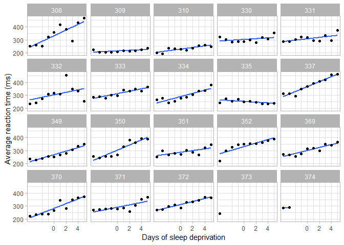
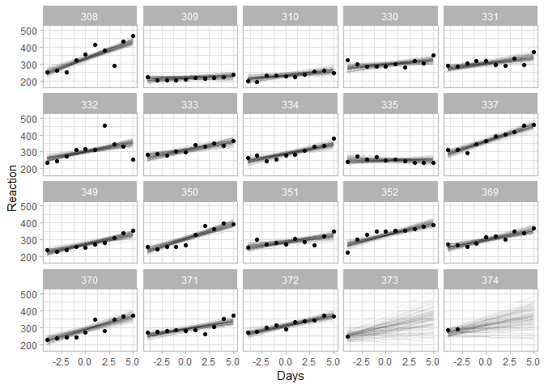
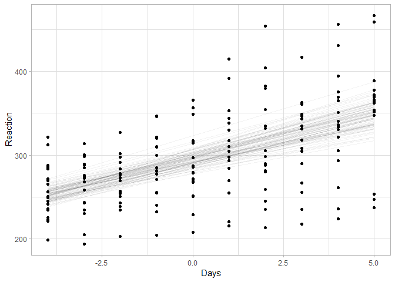
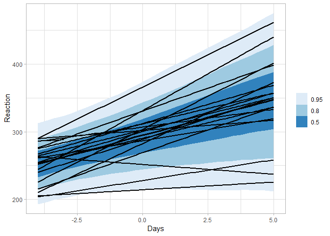
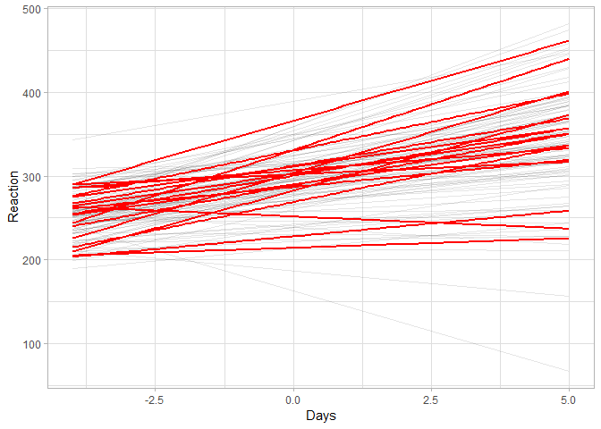

Week 11: Multilevel models \#1: In-class notes
================

## Setup

``` r
library(tidyverse)
library(purrr)
library(magrittr)
library(ggplot2)
library(rstan)
library(rstanarm)
library(brms)
library(modelr)
library(rlang)
library(GGally)
library(tidybayes)            # install from github
library(tidybayes.rethinking) # install from github
library(gganimate)            # install from github
library(rethinking)
library(bayesplot)
library(shinystan)
library(ggstance)

theme_set(theme_light())

# options to make stan use multiple cores
options(mc.cores = parallel::detectCores())
rstan_options(auto_write = TRUE)
```

Portions of the notes here are based on the [this blog
post](https://tjmahr.github.io/plotting-partial-pooling-in-mixed-effects-models/).

### Sleep study data

``` r
df_sleep = lme4::sleepstudy %>%
  bind_rows(
    data_frame(Reaction = c(286, 288), Days = 0:1, Subject = "374"),
    data_frame(Reaction = 245, Days = 0, Subject = "373")
  ) %>%
  mutate(
    Subject = factor(Subject),
    Days = Days - 4
  ) %>%
  arrange(Subject, Days)
```

    ## Warning: `data_frame()` is deprecated, use `tibble()`.
    ## This warning is displayed once per session.

    ## Warning in bind_rows_(x, .id): binding factor and character vector,
    ## coercing into character vector

    ## Warning in bind_rows_(x, .id): binding character and factor vector,
    ## coercing into character vector

``` r
xlab <- "Days of sleep deprivation"
ylab <- "Average reaction time (ms)"

ggplot(df_sleep) + 
  aes(x = Days, y = Reaction) + 
  stat_smooth(method = "lm", se = FALSE) +
  # Put the points on top of lines
  geom_point() +
  facet_wrap("Subject") +
  labs(x = xlab, y = ylab) + 
  # We also need to help the x-axis, so it doesn't 
  # create gridlines/ticks on 2.5 days
  scale_x_continuous(breaks = 0:4 * 2)
```

<!-- -->

### “Random” effects (aka partial pooling) - correlated slopes

$$  $$

``` stan
data{
    int<lower=1> n;
    int<lower=1> n_Subject;
    real Reaction[n];
    real Days[n];
    int Subject[n];
}
parameters{
    real<lower=0> sigma;
    
    vector[2] ab[n_Subject];
    vector[2] mu_ab;
    vector<lower=0>[2] sigma_ab;
    corr_matrix[2] Omega_ab;
}
transformed parameters{
    vector[n_Subject] a;
    vector[n_Subject] b;
    cov_matrix[2] Sigma_ab;

    for (j in 1:n_Subject) {
      a[j] = ab[j,1];
      b[j] = ab[j,2];
    }
    
    Sigma_ab = quad_form_diag(Omega_ab, sigma_ab);  // diag(sigma_ab) * Omega_ab * diag(sigma_ab)
}
model{
    vector[n] mu;
    
    sigma ~ normal(0, 200);
    
    ab ~ multi_normal(mu_ab, Sigma_ab);

    mu_ab ~ normal(0, 500);
    sigma_ab ~ normal(0, 200);
    Omega_ab ~ lkj_corr(1);
    
    for (i in 1:n) {
        mu[i] = a[Subject[i]] + b[Subject[i]] * Days[i];
    }
    
    Reaction ~ normal(mu, sigma);
}
```

``` r
m = sampling(sleep_stan, data = compose_data(df_sleep))
```

    ## Warning: There were 5 divergent transitions after warmup. Increasing adapt_delta above 0.8 may help. See
    ## http://mc-stan.org/misc/warnings.html#divergent-transitions-after-warmup

    ## Warning: Examine the pairs() plot to diagnose sampling problems

``` r
m %<>% recover_types(df_sleep)
```

### Plotting…

``` r
m %>%
  spread_draws(a[Subject], b[Subject]) %>%
  sample_draws(100) %>%
  mutate(Days = list(range(df_sleep$Days))) %>%
  unnest(Days) %>%
  mutate(Reaction = a + b * Days) %>%
  ggplot(aes(x = Days, y = Reaction)) +
  geom_line(aes(group = .draw), alpha = 1/20) + 
  geom_point(data = df_sleep) +
  facet_wrap(~ Subject)
```

<!-- -->

``` r
m %>%
  spread_draws(mu_ab[..]) %>%
  sample_draws(100) %>%
  rename(mu_a = mu_ab.1, mu_b = mu_ab.2) %>%
  mutate(Days = list(range(df_sleep$Days))) %>%
  unnest(Days) %>%
  mutate(Reaction = mu_a + mu_b * Days) %>%
  ggplot(aes(x = Days, y = Reaction)) +
  geom_line(aes(group = .draw), alpha = 1/20) + 
  geom_point(data = df_sleep)
```

<!-- -->

``` r
m %>%
  spread_draws(mu_ab[.]) %>%
  sample_draws(100) %>%
  mutate(
    mu_a = map_dbl(mu_ab, 1), 
    mu_b = map_dbl(mu_ab, 2)
  ) %>%
  mutate(Days = list(range(df_sleep$Days))) %>%
  unnest(Days, .drop = FALSE) %>%
  mutate(Reaction = mu_a + mu_b * Days) %>%
  ggplot(aes(x = Days, y = Reaction)) +
  geom_line(aes(group = .draw), alpha = 1/20) + 
  geom_point(data = df_sleep)
```

<!-- -->

``` r
m %>%
  spread_draws(mu_ab[.], Sigma_ab[.,.]) %>%
  mutate(
    ab = map2(mu_ab, Sigma_ab, rmvnorm, n = 1),
    a = map_dbl(ab, 1), 
    b = map_dbl(ab, 2)
  ) %>%
  mutate(Days = list(seq_range(df_sleep$Days, n = 30))) %>%
  unnest(Days, .drop = FALSE) %>%
  mutate(Reaction = a + b * Days) %>%
  ggplot(aes(x = Days, y = Reaction)) +
  stat_lineribbon() +
  stat_smooth(aes(group = Subject), method = lm, data = df_sleep, se = FALSE, color = "black") +
  scale_fill_brewer()
```

<!-- -->

``` r
m %>%
  spread_draws(mu_ab[.], Sigma_ab[.,.]) %>%
  
  # we are only going to draw 100 lines
  sample_draws(100) %>%
  
  # sample from [a b] ~ Normal([mu_a mu_b], Sigma_ab)
  mutate(
    ab = pmap(list(mean = mu_ab, sigma = Sigma_ab), rmvnorm, n = 1),
    a = map_dbl(ab, 1),
    b = map_dbl(ab, 2)
  ) %>%
  
  # add in a grid of predictors
  mutate(Days = list(range(df_sleep$Days))) %>%
  unnest(Days, .drop = FALSE) %>%
  
  # condition on the predictors
  mutate(Reaction = a + b * Days) %>%
  
  # plot
  ggplot(aes(x = Days, y = Reaction)) +
  geom_line(aes(group = .draw), alpha = 1/10) +
  stat_smooth(aes(group = Subject), method = lm, data = df_sleep, se = FALSE, color = "red") +
  scale_fill_brewer()
```

<!-- -->

## Model simplification

$$  $$

We want to move towards a model where we don’t have to provide
special-case code for intercepts versus slopes (i.e., we don’t want to
have to distinguish between \(\alpha\) and \(\beta\) in writing out all
the hierarchical bits the way we do now, because then we have to add
more code every time we add new coefficients in the expression for
\(\mu_{Reaction}\)). In order to avoid doing that, we are going to
combine \(\alpha\) and \(\beta\) together as follows:

  - Change \(\alpha[j]\) to \(\beta[j,1]\)
  - Change \(\beta[j]\) to \(\beta[j,2]\)

This has some knock-on effects where we’ll want to rename a few other
things as well:

  - Change \(\mu_\alpha\) to \(\mu_\beta[1]\)
  - Change \(\mu_\beta\) to \(\mu_\beta[2]\)
  - Change \(\sigma_\alpha\) to \(\sigma_\beta[1]\)
  - Change \(\sigma_\beta\) to \(\sigma_\beta[2]\)
  - Change \(\Sigma_\alpha\beta\) to \(\Sigma_\beta\)
  - Change \(\Omega_\alpha\beta\) to \(\Omega_\beta\)

$$  $$ Next, to make things a little more generic (in anticipation of
generlizing this model to different responses and different predictors),
we will rename the observation variable, grouping variable, and
predictors:

  - Change \(Reaction\) to \(y\)
  - Change \(Subject\) to \(group\)
  - Change \(Days[i]\) to \(x[i,2]\)
  - Add \(x[i,1]\) (all equal to 1) for the intercept

$$  $$ Next, we we re-write expressions involving \(\beta\), \(x\), and
\(\mu_\beta\) in terms of vectors \(\boldsymbol{\beta}[j]\),
\(\mathbf{x}[i]\), and \(\boldsymbol{\mu}_\beta\):

$$  $$ We can similarly vectorize \(\boldsymbol{\sigma}_\beta\):

$$  $$

Notice that we have now factored out all mention of the number of
coefficients in the linear submodel for \(\mu_y\) into the definitions
of \(\boldsymbol\beta\), \(\mathbf x\), \(\boldsymbol{\mu}_\beta\), and
\(\boldsymbol{\sigma}_\beta\). As a result, we can generalize those
definitions to support any number of predictors/linear coefficients
without touching the rest of the model:

$$  $$

Experimental bits:

$$  $$

The above model constructs \(\Sigma_\beta\) only to decompose it into
\(\mathrm{L_\Sigma}\). However, say we had a Cholesky decomposition of
\(\Omega_\beta\):

\[
\mathrm{L_\Omega} = \mathrm{L_\Omega} \textrm{ such that } \Omega_\beta = \mathrm{L_\Omega} \mathrm{L_\Omega}^\intercal
\]

Then we would have:

$$  $$

Then if we can derive \(\mathrm{L_\Sigma}\) we can skip over calculating
\(\Sigma_\beta\) and calculate \(\mathrm{L_\Sigma}\) directly.
Fortunately, Stan has support for the \(\textrm{LKJCorrCholesky}\)
distribution, which has the following property:

\[
\begin{align}
\textit{if} &&\Omega &\sim \textrm{LKJCorr}(\nu) \\
\textit{and} &&\Omega &= \mathrm{LL^\intercal}
  && \textit{Cholesky decomposition} \\
\textit{then} &&\mathrm{L} &\sim \textrm{LKJCorrCholesky}(\nu)
\end{align}
\] This means we can simplify the last bit of the model:

$$  $$
