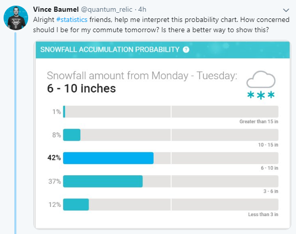

## Setup

The following libraries are needed:

```{r setup, message = FALSE, warning = FALSE}
library(tidyverse)
library(tidybayes)
library(gganimate)
```


## Introduction

This is a silly example based on [this tweet](https://twitter.com/quantum_relic/status/1095053598155784192):



To generate a quantile dotplot from this, I am going to start by approximating an inverse cumulative distribution function, `F_inv`, for these predictions (aka a quantile function). I am doing this rather than just turning the above histogram directly into dots because the bin widths above are not equal, and because it will make a smoother-looking plot. This is probably overkill.

```{r}
F_inv = splinefun(     # or use approxfun for linear interpolation
  c(0, .12, .49, .91, .99,  1),
  c(0,   3,   6,  10,  15, 20),
  method = "monoH.FC"
  )
```

The quantile function I've derived looks like this:

```{r, fig.width = 4, fig.height = 4}
curve(F_inv(x), xlim = c(0,1))
```

## Quantile dotplots

We can now use the inverse CDF to generate quantiles from the predictive distribution and construct quantile dotplots. E.g. a 50-dot dotplot:

```{r, fig.width = 4, fig.height = 3}
tibble(
  p = ppoints(50),
  snowfall = F_inv(p)
) %>%
  ggplot(aes(x = snowfall)) +
  geom_dotplot(method = "histodot", binwidth = 1, origin = 0, dotsize = .96, stackratio = 1.03) +
  scale_y_continuous(breaks = NULL) +
  scale_x_continuous(breaks = seq(0, 18, by = 2)) +
  coord_cartesian(expand = FALSE, xlim = c(0,18)) +
  xlab("Predicted snowfall in inches. Each dot represents a 1/50\nchance of that level of snowfall.") +
  ylab(NULL) +
  theme_tidybayes() +
  theme(axis.title.x.bottom = element_text(hjust = 0), axis.line.x.bottom = element_line(color = "gray75"))
```

Or a 100-dot dotplot:

```{r, fig.width = 4, fig.height = 4.5}
tibble(
  p = ppoints(100),
  snowfall = F_inv(p)
) %>%
  ggplot(aes(x = snowfall)) +
  geom_dotplot(method = "histodot", binwidth = 1, dotsize = .9, stackratio = 1.05, origin = 0) +
  scale_y_continuous(breaks = NULL) +
  scale_x_continuous(breaks = seq(0, 18, by = 2)) +
  coord_cartesian(expand = FALSE, xlim = c(0,18)) +
  xlab("Predicted snowfall in inches. Each dot represents a 1/100\nchance of that level of snowfall.") +
  ylab(NULL) +
  theme_tidybayes() +
  theme(axis.title.x.bottom = element_text(hjust = 0), axis.line.x.bottom = element_line(color = "gray75"))
```

Vince Baumel [pointed out](https://twitter.com/quantum_relic/status/1095132365800853504) that this might look like a pile of snow, so why not push the metaphor with color?

```{r, fig.width = 4, fig.height = 4.5}
tibble(
  p = ppoints(100),
  snowfall = F_inv(p)
) %>%
  ggplot(aes(x = snowfall)) +
  geom_dotplot(method = "histodot", binwidth = 1, dotsize = .9, stackratio = 1.05, origin = 0, fill = "white", color = NA) +
  scale_y_continuous(breaks = NULL) +
  scale_x_continuous(breaks = seq(0, 18, by = 2)) +
  coord_cartesian(expand = FALSE, xlim = c(0,18)) +
  xlab("Predicted snowfall in inches. Each dot represents a 1/100\nchance of that level of snowfall.") +
  ylab(NULL) +
  theme_tidybayes() +
  theme(
    axis.title.x.bottom = element_text(hjust = 0), 
    axis.line.x.bottom = element_line(color = "gray75"),
    panel.background = element_rect(fill = "skyblue")
  )
```

## HOPs

We could also randomly re-order the quantiles to generate a hypothetical outcome plot:

```{r}
anim = tibble(
  p = ppoints(100),
  snowfall = F_inv(p)
) %>%
  sample_n(100) %>%
  mutate(id = 1:n()) %>%
  ggplot() +
  geom_vline(aes(xintercept = snowfall)) +
  scale_y_continuous(breaks = NULL) +
  scale_x_continuous(breaks = seq(0, 18, by = 2)) +
  coord_cartesian(expand = FALSE, xlim = c(0,18)) +
  xlab("Predicted snowfall in inches. Each line is an approximately\nequally likely predicted outcome.") +
  ylab(NULL) +
  theme_tidybayes() +
  theme(axis.title.x.bottom = element_text(hjust = 0), axis.line.x.bottom = element_line(color = "gray75")) +
  transition_manual(id)

animate(anim, fps = 2.5, res = 100, width = 400, height = 200)
```
